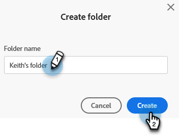
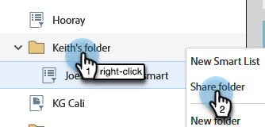
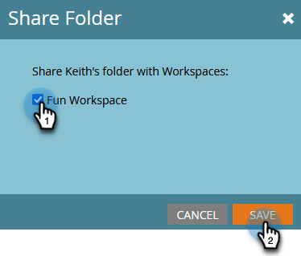

# Fazer referência a uma lista ou lista inteligente em espaços de trabalho {#reference-a-list-or-smart-list-across-workspaces}

Listas e Smart Lists podem ser compartilhadas e referenciadas em espaços de trabalho para fácil reutilização do Banco de Dados.

>[!NOTE]
>
>As regras de partição de pessoa se aplicam (Smart Lists e listas estáticas em um espaço de trabalho mostram apenas pessoas que são membros da lista _e_ membros do espaço de trabalho atual).

## Compartilhar uma lista ou lista inteligente {#share-a-list-or-smart-list}

1. Vá para o **[!UICONTROL Banco de Dados]**.

   

1. Clique com o botão direito do mouse em uma pasta de campanha. Selecione **[!UICONTROL Nova Pasta]**.

   

   >[!NOTE]
   >
   >O Assets só poderá ser compartilhado entre espaços de trabalho se eles estiverem aninhados em uma pasta.

1. Nomeie a pasta e clique em **[!UICONTROL Criar]**.

   

1. Arraste e solte uma lista ou lista inteligente que deseja compartilhar na nova pasta.

   

1. Clique com o botão direito do mouse na nova pasta e selecione **[!UICONTROL Compartilhar pasta]**.

   

1. Escolha uma **[!UICONTROL Workspace]** para compartilhar com e clique em **[!UICONTROL Salvar]**.

   

   Essa lista agora estará disponível em ambos os espaços de trabalho.

   >[!NOTE]
   >
   >Em Atividades de marketing, você só pode compartilhar pastas de nível superior. No Banco de Dados, você pode compartilhar pastas de nível superior e de nível inferior.
