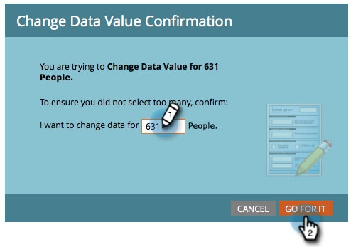

# Executar uma única etapa de fluxo a partir de uma lista inteligente {#run-a-single-flow-step-from-a-smart-list}

Se você quiser executar uma etapa de fluxo única, poderá usar uma única etapa de fluxo em uma Smart List em vez de criar uma Campanha Inteligente inteira.

>[!PREREQUISITES]
>
>[Criar uma lista inteligente](/help/marketo/product-docs/core-marketo-concepts/smart-lists-and-static-lists/creating-a-smart-list/create-a-smart-list.md){target="_blank"}

1. Ir para **[!UICONTROL Atividades de marketing]**.

   

1. Selecione uma lista ou uma Smart List com pessoas e vá para a **[!UICONTROL Pessoas]** guia.

   

   >[!TIP]
   >
   >As listas estáticas e as Smart Lists têm essa funcionalidade.

1. Clique em **[!UICONTROL Selecionar tudo]**. Também é possível usar **Ctrl/Cmd** e clique em para selecionar alguns registros manualmente.

   

   >[!NOTE]
   >
   >Se os resultados se estenderem por várias páginas, clique em **[!UICONTROL Selecionar tudo]** selecionará todas as pessoas em todas as páginas.

1. Em **[!UICONTROL Ações da pessoa]**, selecione a etapa de fluxo de sua escolha. Neste exemplo, usaremos [Alterar valor dos dados](/help/marketo/product-docs/core-marketo-concepts/smart-campaigns/flow-actions/change-data-value.md){target="_blank"}.

   

1. Localize e selecione um **[!UICONTROL Atributo]**. Neste exemplo, pegaremos todas as pessoas que têm estado &quot;Califórnia&quot; e alteraremos para &quot;CA&quot;.

   

1. Inserir um novo valor. Clique em **[!UICONTROL Executar agora]**.

   

1. Se você estiver alterando os valores de dados de um grande número de pessoas, talvez seja necessário confirmar a alteração digitando o número. Clique em **[!UICONTROL Vá em frente]**.

   

Ótimo trabalho! Você verá o status da etapa de fluxo único no canto superior direito.

Quando terminar, atualize a lista e você verá as informações atualizadas.
