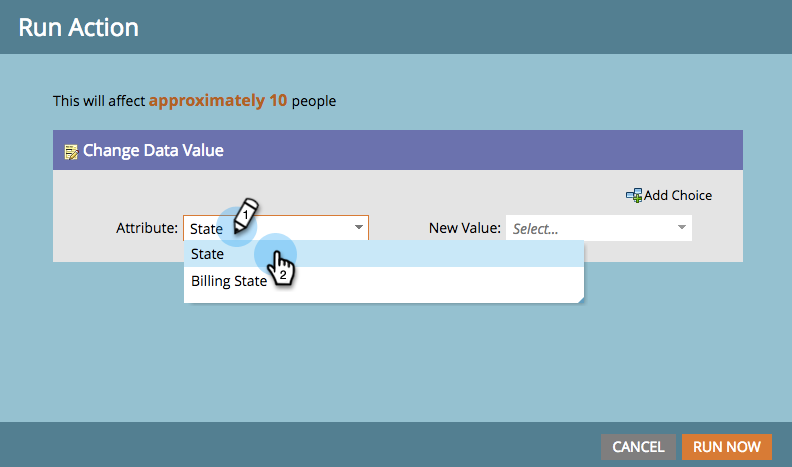

# Executar uma única etapa de fluxo de uma lista inteligente {#run-a-single-flow-step-from-a-smart-list}

Se você quiser executar uma etapa de fluxo única, poderá usar uma única etapa de fluxo em uma Smart List em vez de criar uma Campanha Inteligente inteira.

>[!PREREQUISITES]
>
>[Criar uma lista inteligente](/help/marketo/product-docs/core-marketo-concepts/smart-lists-and-static-lists/creating-a-smart-list/create-a-smart-list.md){target="_blank"}

1. Acesse **[!UICONTROL Atividades de marketing]**.

   

1. Selecione uma lista ou uma Smart List com pessoas e vá para a guia **[!UICONTROL Pessoas]**.

   

   >[!TIP]
   >
   >As listas estáticas e as Smart Lists têm essa funcionalidade.

1. Clique em **[!UICONTROL Selecionar tudo]**. Você também pode usar **Ctrl/Cmd** e clicar para selecionar alguns registros manualmente.

   

   >[!NOTE]
   >
   >Se os resultados se estenderem por várias páginas, ao clicar em **[!UICONTROL Selecionar tudo]**, serão selecionadas todas as pessoas em todas as páginas.

1. Em **[!UICONTROL Ações da pessoa]**, selecione a etapa de fluxo de sua escolha. Este exemplo usa [Alterar Valor de Dados](/help/marketo/product-docs/core-marketo-concepts/smart-campaigns/flow-actions/change-data-value.md){target="_blank"}.

   

1. Localize e selecione um **[!UICONTROL Atributo]**. Neste exemplo, pegaremos todas as pessoas que têm estado &quot;Califórnia&quot; e alteraremos para &quot;CA&quot;.

   

1. Insira um novo valor. Clique em **[!UICONTROL Executar Agora]**.

   

1. Se você estiver alterando os valores de dados de um grande número de pessoas, talvez seja necessário confirmar a alteração digitando o número. Clique Em **[!UICONTROL Ir Para Ele]**.

   

O status da etapa de fluxo única aparecerá no canto superior direito.

Quando terminar, atualize a lista e você verá as informações atualizadas.
