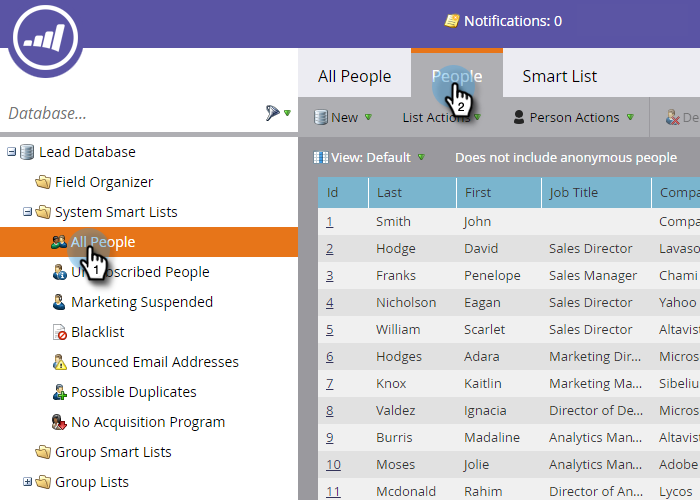

# Usar Smart Lists Integradas/do Sistema {#use-built-in-system-smart-lists}

O Marketo tem algumas listas inteligentes integradas muito úteis. Vamos dar uma olhada!

1. Vá para a **Banco de dados**.

   

1. Abra o **Listas inteligentes do sistema** pasta para revelar a coleção.

   

1. Para ver um exemplo: Selecione **Todas as pessoas** e, em seguida, clique na guia **Pessoas** guia.

   

   >[!NOTE]
   >
   >Os filtros em listas inteligentes do sistema não precisam ser aplicados a cada lista/campanha inteligente. Seu conteúdo é reconhecido automaticamente.

Este é um resumo do que as listas inteligentes integradas fazem:

| Nome da lista | Descrição |
|---|---|
| Todas as pessoas | Todas as pessoas no banco de dados do Marketo |
| Pessoas que cancelaram a inscrição | Essas pessoas só podem receber emails operacionais; isso geralmente é controlado pela própria pessoa. |
| Marketing suspenso | Essas pessoas só podem receber emails operacionais; geralmente, isso é controlado por você, o profissional de marketing. |
| Lista de bloqueios | Essas pessoas não receberão nenhum email. |
| Endereços de email com mensagens rejeitadas | Pessoas com um endereço de email não entregue ou que rejeitam seu email. |
| Possíveis duplicatas | Pessoas que podem ser duplicadas no banco de dados do Marketo. |

>[!NOTE]
>
>As listas inteligentes do sistema não podem ser excluídas. Com exceção da lista de Duplicatas possíveis, eles também não podem ser editados.

>[!MORELIKETHIS]
>
>[Criar uma lista inteligente](/help/marketo/product-docs/core-marketo-concepts/smart-lists-and-static-lists/creating-a-smart-list/create-a-smart-list.md)
