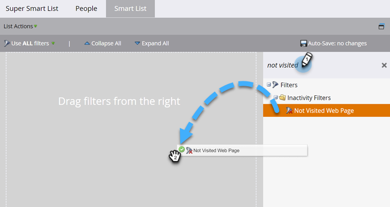
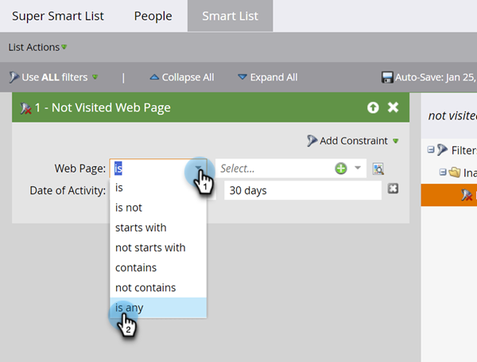

# Usar filtros de inatividade em uma lista inteligente {#use-inactivity-filters-in-a-smart-list}

Use os filtros de inatividade para localizar pessoas em uma Smart List que não fizeram algo.

1. Acesse **[!UICONTROL Atividades de marketing]**.

   

1. Selecione a Smart List que deseja editar e clique na guia **[!UICONTROL Smart List]**.

   

1. Localize e arraste o filtro de inatividade de sua escolha para a tela. Como exemplo, este exemplo encontra pessoas que não visitaram nenhuma de suas páginas.

   

   >[!TIP]
   >
   >Há muitos filtros na pasta **[!UICONTROL Filtros de Inatividade]**. Procure por &quot;Não&quot; e confira-os.

1. Selecione o operador **[!UICONTROL é qualquer]**. Isso encontrará todas as pessoas que não visitaram nenhuma página nos últimos 30 dias.

   
