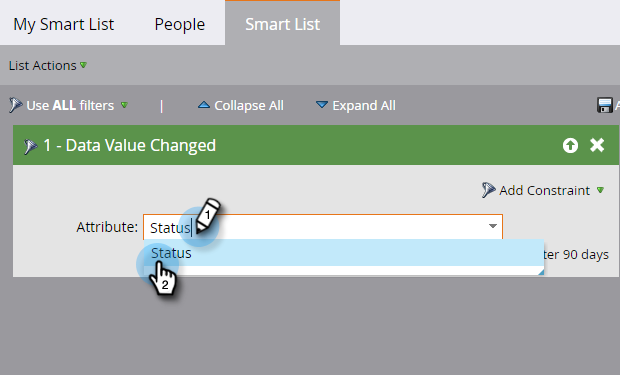

# Usar o filtro Valor de dados alterado em uma Lista inteligente {#use-the-data-value-changed-filter-in-a-smart-list}

Os valores estão constantemente mudando e sendo atualizados no banco de dados do Marketing to. Às vezes, em vez de procurar um valor específico, você quer procurar pessoas que tiveram uma mudança de valor. Veja como.

>[!PREREQUISITES]
>
>[Criar uma Lista inteligente](/help/marketo/product-docs/core-marketo-concepts/smart-lists-and-static-lists/creating-a-smart-list/create-a-smart-list.md)

1. Vá para a área **Atividades de marketing**.

   

1. Selecione a lista inteligente e clique na guia **Lista inteligente**.

   

1. Localize o filtro **Valor de dados alterado** e arraste-o para a tela de desenho.

   

1. Defina **Atributo** para o campo no qual deseja procurar alterações no valor dos dados.

   

Esse filtro procurará todas as pessoas que tiveram uma alteração (qualquer alteração) em seu Status. Se quiser ficar ainda mais sofisticado, tente [adicionar uma restrição a um filtro de lista inteligente](/help/marketo/product-docs/core-marketo-concepts/smart-lists-and-static-lists/using-smart-lists/add-a-constraint-to-a-smart-list-filter.md).
