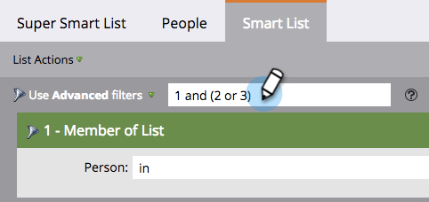

# Usando a lógica avançada da regra de Lista inteligente {#using-advanced-smart-list-rule-logic}

Você pode encontrar as pessoas exatas de que precisa aplicando a lógica da regra da lista inteligente a vários filtros em uma lista inteligente. Veja como.

>[!PREREQUISITES]
>
>* [Localizar e adicionar Filtros a uma Lista inteligente](../../../../product-docs/core-marketo-concepts/smart-lists-and-static-lists/creating-a-smart-list/find-and-add-filters-to-a-smart-list.md)
>* [Definir Filtros de Lista inteligente](../../../../product-docs/core-marketo-concepts/smart-lists-and-static-lists/creating-a-smart-list/define-smart-list-filters.md)

>

>[!NOTE]
>
>A lógica de filtro avançada só estará disponível se houver três ou mais filtros na sua lista inteligente.

## Adicionar lógica a uma Lista inteligente {#add-logic-to-a-smart-list}

Por padrão, sua lista inteligente encontrará as pessoas que correspondem aos filtros **ALL** (filtros 1 *e* 2 *e* 3). Você pode alterar a lógica da regra para encontrar pessoas que correspondam a **ANY** dos filtros definidos (filtros 1 *ou* 2 *ou* 3), ou usar filtros avançados (filtros 1 *e* 2 *ou *3).

Neste exemplo, digamos que você queira encontrar pessoas na Califórnia *e* com uma pontuação de pelo menos 50 pontos *ou* com um status de &quot;Vendas qualificadas&quot;.

1. Selecione **Use** **Advanced** **filtros** no menu suspenso.

   

   >[!NOTE]
   >
   >Usar listas **Avançadas** reduz a necessidade de criar filtros inteligentes com o membro do filtro Lista inteligente. Isso ajuda a otimizar o desempenho.

1. A caixa de texto **Advanced** **filtros** exibirá &quot;e&quot; como o valor padrão entre todos os seus filtros.

   

1. Digite um par de parênteses em torno de &quot;2 e 3&quot;.

   

   >[!CAUTION]
   >
   >Você deve usar &quot;e&quot; antes de &quot;ou&quot; ao inserir a lógica da regra.

1. Altere &quot;e&quot; entre &quot;2 e 3&quot; para &quot;ou&quot;.

   

## Usar parênteses ao misturar &quot;E&quot; e &quot;Ou {#use-parentheses-when-mixing-and-and-or}

Misturar a lógica &quot;e&quot; e &quot;ou&quot; requer parênteses para tornar sua intenção clara.

## Use parênteses aninhados para quatro ou mais Filtros se necessário {#use-nested-parentheses-for-four-or-more-filters-if-needed}

Dependendo de sua intenção, talvez seja necessário adicionar parênteses aninhados ao usar quatro ou mais filtros.

>[!TIP]
>
>Se você inserir uma regra inválida, verá uma linha vermelha sendo exibida sob a regra. Role sobre o texto para ver a mensagem de erro relacionada.

