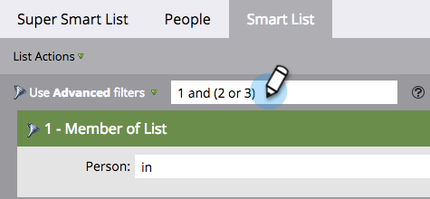

# Utilização da Lógica de Regra Avançada da Smart List {#using-advanced-smart-list-rule-logic}

Você pode encontrar as pessoas exatas de que precisa aplicando a lógica da regra de Smart List a vários filtros em uma Smart List. Veja como.

>[!PREREQUISITES]
>
>* [Localizar e Adicionar Filtros a uma Lista Inteligente](/help/marketo/product-docs/core-marketo-concepts/smart-lists-and-static-lists/creating-a-smart-list/find-and-add-filters-to-a-smart-list.md){target="_blank"}
>* [Definir Filtros da Lista Inteligente](/help/marketo/product-docs/core-marketo-concepts/smart-lists-and-static-lists/creating-a-smart-list/define-smart-list-filters.md){target="_blank"}

>[!NOTE]
>
>A lógica de filtro avançada só estará disponível se houver três ou mais filtros na Smart List.

## Adicionar lógica a uma lista inteligente {#add-logic-to-a-smart-list}

Por padrão, sua Smart List encontrará as pessoas que correspondem aos **[!UICONTROL TODOS]** filtros (filtros 1 _e_ 2 _e_ 3). Você pode alterar a lógica da regra para localizar pessoas que correspondam a **[!UICONTROL QUALQUER UM]** dos filtros definidos (filtros 1 _ou_ 2 _ou_ 3), ou usar filtros avançados (filtros 1 _e_ 2 _ou_ 3).

Neste exemplo, digamos que você queira encontrar pessoas na Califórnia _e_ com uma pontuação de pelo menos 50 pontos _ou_ com o status &quot;Vendas Qualificadas&quot;.

1. Selecione **[!UICONTROL Usar filtros avançados]** no menu suspenso.

   

   >[!NOTE]
   >
   >Usar filtros **[!UICONTROL Avançados]** reduz a necessidade de criar Smart Lists com o filtro Membro da Smart List. Isso ajuda a otimizar o desempenho.

1. A caixa de texto **[!UICONTROL Filtros avançados]** exibirá &quot;e&quot; como o valor padrão entre todos os filtros.

   

1. Digite um par de parênteses ao redor de &quot;2 e 3&quot;.

   

   >[!CAUTION]
   >
   >Você deve usar &quot;e&quot; antes de &quot;ou&quot; ao inserir a lógica da regra.

1. Altere o &quot;e&quot; entre &quot;2 e 3&quot; para &quot;ou&quot;.

   

## Use parênteses ao misturar &quot;And&quot; e &quot;Or&quot; {#use-parentheses-when-mixing-and-and-or}

A combinação da lógica &quot;and&quot; e &quot;or&quot; exige parênteses para deixar sua intenção clara.

## Use parênteses aninhados para quatro ou mais filtros, se necessário {#use-nested-parentheses-for-four-or-more-filters-if-needed}

Dependendo da sua intenção, talvez seja necessário adicionar parênteses aninhados ao usar quatro ou mais filtros.

>[!TIP]
>
>Se você inserir uma regra inválida, verá uma linha vermelha exibida abaixo da regra. Role sobre o texto para ver a mensagem de erro relacionada.
