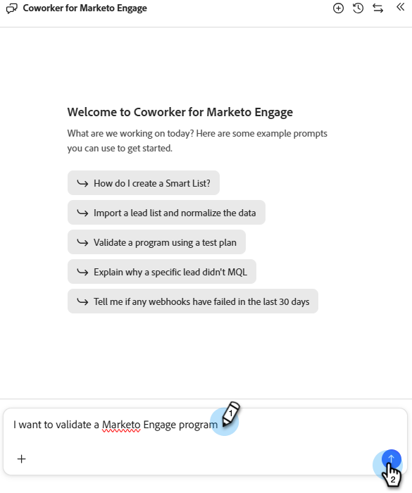

# Validar programas {#validate-programs}

Faça auditoria de seus programas para obter as práticas recomendadas para todos os componentes, como emails, landing pages, campanhas e muito mais.

## Como usar {#how-to-use}

1. Em Meu Marketo, clique no bloco **Colaborador do Marketo Engage**.

   

1. Digite &quot;Desejo validar um programa do Marketo Engage&quot; na janela do prompt.

   

1. No painel direito, selecione o programa que deseja validar.

   {width="800" zoomable="yes"}

   Um resumo do programa selecionado é exibido no painel central.

1. Na janela do prompt, digite &quot;validar programa&quot; e clique em **Enviar**.

   O colaborador do Marketo Engage fornece um controle de qualidade do programa selecionado, mostrando o que foi aprovado e o que falhou.

   
