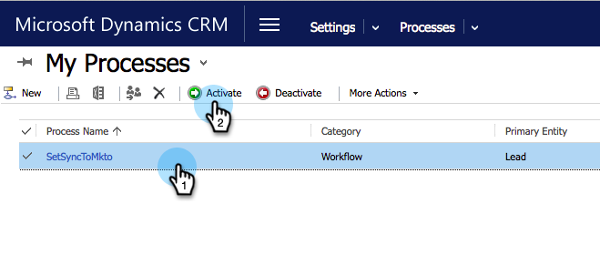

# Criar um filtro de sincronização personalizado do Dynamics {#create-a-custom-dynamics-sync-filter}

Não deseja sincronizar tudo no Dynamics CRM com o Marketo? Não se preocupe! O Marketo permite configurar um filtro de sincronização e sincronizar apenas parte de seus registros.

## Visão geral {#overview}

Para configurar um filtro de sincronização do Dynamics:

1. Crie um campo personalizado de Duas Opções (booleano) chamado new_synctomkto no Dynamics CRM para qualquer objeto (cliente potencial, contato, conta, oportunidade e outras entidades personalizadas).
1. Atribua um valor Sim/Não a esse campo.

Essas alterações devem ser feitas no Dynamics CRM, não no banco de dados ou no Marketo.

>[!CAUTION]
>
>Se você não atribuir o campo e deixá-lo em branco/NULO, ele será sincronizado, mas não será atualizado.

O Marketo procura esse campo durante a sincronização automática em segundo plano e determina em quais registros sincronizar com base nessa lógica:

| Valor do campo | Sincronizar com o Marketo? |
|---|---|
| O campo não existe | Sim |
| O campo está vazio | Sim |
| O campo tem valor Sim | Sim |
| O campo tem o valor Não | Não |

>[!CAUTION]
>
>A única maneira de instruir o Marketo a ignorar um registro é definir explicitamente o valor do campo como **Não**. O Marketo ainda sincroniza registros mesmo se os valores dos campos estiverem vazios.

>[!PREREQUISITES]
>
>Instale a versão mais recente do plug-in do Marketo (3.0.0.1 ou posterior). Acesse Marketo > Administração > Microsoft Dynamics > Baixar solução da Marketo.

## Criar campo SyncToMkto {#create-synctomkto-field}

1. Faça logon no Dynamics CRM. Clique em **Configurações** e, em seguida, clique em **Personalizações**.

   

1. Clique em **Personalizar o sistema**.

   

1. Clique em  ao lado de **Entidades**.

   

1. Clique em  ao lado de **Lead** e selecione **Campos**. Clique em **Novo**.

   

1. Enter **SyncToMkto** no **Nome de exibição** e selecione **Duas opções** como o **Tipo de dados**. Clique em **Salvar e fechar**.

   

   >[!NOTE]
   >
   >Escolha qualquer nome de exibição para este campo, mas o campo Nome deve ser exatamente **new_synctomkto**. Você deve usar **novo** como o prefixo padrão. Se você alterou o padrão, acesse aqui para [redefinir o prefixo padrão para os nomes de campo personalizados](/help/marketo/product-docs/crm-sync/microsoft-dynamics-sync/create-a-custom-dynamics-sync-filter/set-a-default-custom-field-prefix.md){target="_blank"}. Você pode alterá-la de volta após criar os novos campos.

   >[!NOTE]
   >
   >Se você tiver configurado um fluxo de trabalho assíncrono, o registro obterá o valor SyncToMkto padrão definido no campo e o valor correto será obtido alguns segundos depois, quando o fluxo de trabalho terminar de ser executado. Se o valor padrão for definido como Sim, esses registros serão criados no Marketo e se tornarão obsoletos. Uso **Não** como o valor padrão para evitar isso.

1. Repita esse processo e crie a variável **SyncToMkto** para quaisquer outras entidades nas quais você deseja limitar a sincronização, como contato, conta, oportunidade e entidades personalizadas.

## Selecione o filtro no Marketo {#select-the-filter-in-marketo}

Mesmo que você já tenha feito a sincronização inicial, acesse e selecione os campos a serem sincronizados com o Marketo.

1. Acesse Administrador e selecione **[!UICONTROL Microsoft Dynamics]**.

   

1. Clique em **[!UICONTROL Editar]** em Detalhes da sincronização de campo.

   

1. Role para baixo até o campo e marque-o. O nome real deve ser new_synctomkto, mas o Nome de exibição pode ser qualquer item. Clique em **[!UICONTROL Salvar]**.

   

Ótimo, agora você ativou o filtro de sincronização do Marketo.

## Criar um fluxo de trabalho do Dynamics para atribuir valores do filtro de sincronização automaticamente {#create-a-dynamics-workflow-to-assign-sync-filter-values-automatically}

Você sempre pode atribuir um valor manualmente aos campos SyncToMkto para seus registros. Mas por que não aproveitar o potencial de um fluxo de trabalho do Dynamics e atribuir automaticamente um valor ao campo SyncToMkto quando um registro é criado ou atualizado?

>[!NOTE]
>
>Você não pode fazer isso no nível do banco de dados. Isso deve ser feito no CRM manualmente ou usando um workflow.
>
>Um fluxo de trabalho do Dynamics funciona somente em novos registros criados a partir de agora, não em dados históricos. Use uma atualização em lote para mover registros existentes.

1. Vá para o Dynamics CRM. Clique em **Configurações**, depois **Processos**.

   

1. Clique em **Novo**.

   

1. Insira um nome para o workflow e selecione **Fluxo de trabalho** como categoria e **Lead** como a Entidade. Clique em **OK**.

   

1. Crie regras para atribuir um valor verdadeiro ou falso à variável **SyncToMkto** campo com base na preferência de sua organização. Clique em **Salvar e fechar**.

   

   >[!NOTE]
   >
   >Defina uma ação padrão depois de clicar em **Adicionar etapa** para adicionar uma Condição de verificação. Isso define os registros que você não deseja sincronizar **Não**. Caso contrário, eles serão sincronizados.

1. Selecione o workflow e clique em **Ativar**.

   

   >[!TIP]
   >
   >Consulte [Regras de Filtro de Sincronização Personalizada para um Endereço de Email](/help/marketo/product-docs/crm-sync/microsoft-dynamics-sync/create-a-custom-dynamics-sync-filter/custom-sync-filter-rules-for-an-email-address.md){target="_blank"} para configurar regras para sincronizar apenas registros de pessoas com endereços de email.

## Detalhes do Filtro de Sincronização {#sync-filter-details}

Estes são alguns detalhes de implementação que pensamos que você deveria saber:

* Iniciar uma Operação de Sincronização

  Quando a variável **SyncToMkto** o valor muda de **Não** para **Sim**, o Dynamics notifica o Marketo imediatamente para começar a sincronizar esse registro. Se o registro já existir, o Marketo o atualizará. Caso contrário, o Marketo criará o registro.

  >[!TIP]
  >
  >A `Create [StartSync]` A operação é adicionada ao log do Marketo quando isso ocorre.

* Parar uma operação de sincronização

  Quando um registro altera seu valor SyncToMkto de Sim para Não, a Marketo é notificada para interromper a sincronização desse registro. No entanto, o registro não é excluído. Em vez disso, ele pára de obter atualizações e se torna obsoleto.

>[!MORELIKETHIS]
>
>* [Filtro de Sincronização do Microsoft Dynamics: Qualificar](/help/marketo/product-docs/crm-sync/microsoft-dynamics-sync/create-a-custom-dynamics-sync-filter/microsoft-dynamics-sync-filter-qualify.md){target="_blank"}
>* [Filtro de Sincronização do Microsoft Dynamics: Mesclar](/help/marketo/product-docs/crm-sync/microsoft-dynamics-sync/create-a-custom-dynamics-sync-filter/microsoft-dynamics-sync-filter-merge.md){target="_blank"}
>* [Regras de Filtro de Sincronização Personalizada para um Endereço de Email](/help/marketo/product-docs/crm-sync/microsoft-dynamics-sync/create-a-custom-dynamics-sync-filter/custom-sync-filter-rules-for-an-email-address.md){target="_blank"}
