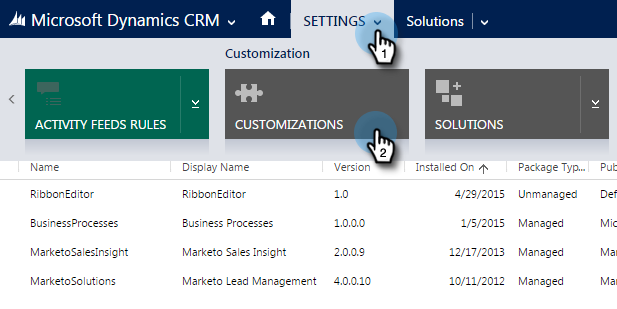
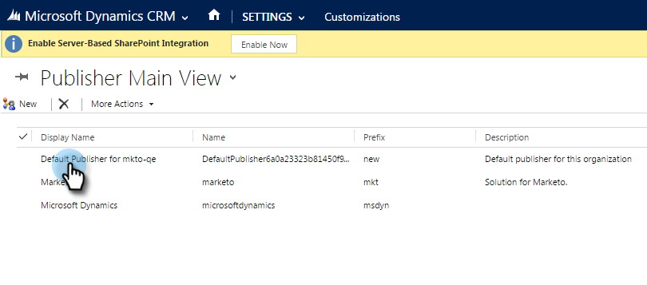

# Definir um prefixo de campo personalizado padrão {#set-a-default-custom-field-prefix}

Seu prefixo [!DNL Microsoft Dynamics] padrão para campos personalizados deve ser **novo** para que os campos proprietários do Marketo sejam sincronizados corretamente.

1. Vá para [!UICONTROL Configurações] e selecione **[!UICONTROL Personalizações].**

   

1. Clique em **[!UICONTROL Publicadores]**.

   

1. Selecione o editor padrão na lista.

   

1. Alterar o prefixo para **novo**. Clique em **[!UICONTROL Salvar e fechar]**.

   

1. Vá para [!UICONTROL Configurações] > [!UICONTROL Soluções] para publicar as personalizações.

   

1. Clique em **[!UICONTROL Publicar todas as personalizações]**.

   

1. Agora, crie seus campos personalizados. Depois de concluí-los, reverta o prefixo para o original.
