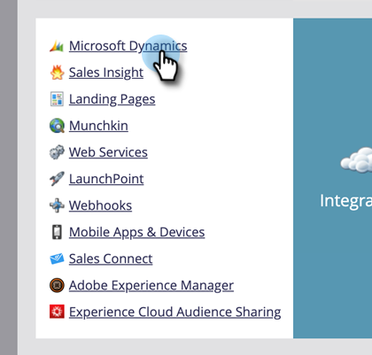

# Habilitar sincronização de campanhas {#enable-campaign-sync}

Esta opção permite que o Marketo adicione e remova membros do [!DNL MS Dynamics] Campaign.

>[!PREREQUISITES]
>
>Atualize para a versão mais recente do plug-in [!DNL Dynamics] para Marketo.

>[!NOTE]
>
>**Permissões de administrador necessárias**

1. Em sua **[!UICONTROL My Marketo]**, clique em **[!UICONTROL Admin]**.

   

1. Clique em **[!UICONTROL Microsoft Dynamics]**.

   

1. Em **[!UICONTROL Opções de sincronização]**, clique em **[!UICONTROL Editar]**.

   

1. Marque a caixa de seleção **[!UICONTROL Habilitar a sincronização do Microsoft Dynamics Campaign]** e clique em **[!UICONTROL Salvar]**.

   

É isso aí. Dê algum tempo à sincronização para obter os dados de [!DNL Microsoft Dynamics] e você pode continuar.

>[!NOTE]
>
>Redefinir a caixa de seleção de Sincronização de Campanha [!DNL Dynamics] atualizará todos os dados da campanha sincronizados anteriormente e as associações com as Listas de Marketing em [!DNL Dynamics].
