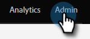

# Habilitar Sincronização para uma Entidade Personalizada {#enable-sync-for-a-custom-entity}

Se você precisar que os dados de entidade personalizados do Dynamics estejam disponíveis no Marketo Engage, veja como habilitar a sincronização para eles.

>[!NOTE]
>
>**Permissões de administrador necessárias**

>[!NOTE]
>
>* Quando você habilita a sincronização de uma entidade personalizada, o Marketo executa uma sincronização inicial para trazer todos os dados do Objeto personalizado.
>* A Lista de Marketing e os Membros da Lista de Marketing _não são suportados_ no momento.

>[!IMPORTANT]
>
>O usuário de sincronização do Marketo precisa de acesso de leitura ao objeto personalizado para listá-lo e executar uma sincronização nele.

1. Vá para a seção **[!UICONTROL Admin]**.

   

1. Selecione **[!UICONTROL Microsoft Dynamics]** e clique em **[!UICONTROL Desabilitar Sincronização]**.

   

   >[!NOTE]
   >
   >Você deve desabilitar a sincronização global temporariamente para habilitar ou desabilitar uma entidade personalizada.

1. Em Gerenciamento de Banco de Dados, clique em **[!UICONTROL Sincronização de Entidades do Dynamics]**.

   

1. Clique em **[!UICONTROL Sincronizar esquema]**.

   

1. Selecione a entidade que deseja sincronizar e clique em **[!UICONTROL Habilitar Sincronização]**.

   

1. Selecione os campos que deseja sincronizar ou usar como [restrições](/help/marketo/product-docs/core-marketo-concepts/smart-lists-and-static-lists/using-smart-lists/add-a-constraint-to-a-smart-list-filter.md) e/ou acionadores (para registros adicionados, _não_ atualizados) em Smart Lists. Quando terminar, clique em **[!UICONTROL Habilitar Sincronização]**.

   

   >[!NOTE]
   >
   >Durante o processo de sincronização, você pode notar que o item &quot;[!UICONTROL Sincronização de Entidades Dinâmicas]&quot; desaparece da árvore de navegação. Esse comportamento é esperado e reaparecerá após a conclusão da sincronização.

1. A entidade agora tem uma marca de seleção verde.

   

1. Não se esqueça de reativar a sincronização global!

   
