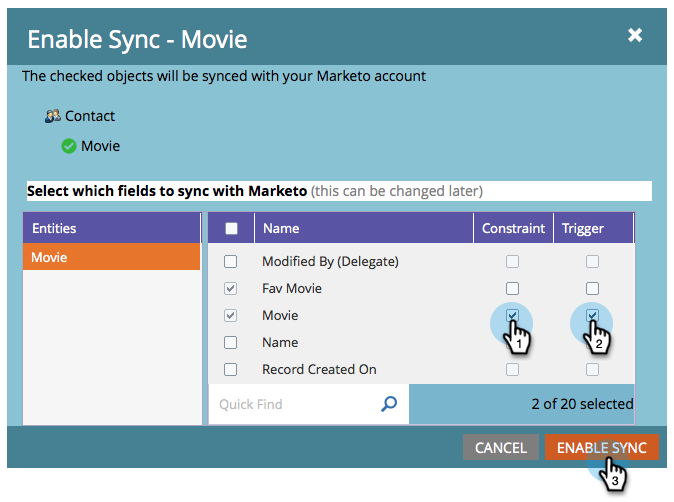
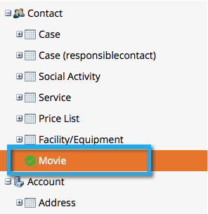

# Ativar Sincronização para uma Entidade Personalizada {#enable-sync-for-a-custom-entity}

Se você precisar que os dados de entidade personalizados do Dynamics estejam disponíveis no Marketo, veja como habilitar a sincronização:

>[!NOTE]
>
>**Permissões de administrador necessárias**

1. Vá para a seção **Admin**.

   

1. Selecione **Microsoft Dynamics** e clique em **Desativar Sincronização**.

   Você deve desativar temporariamente a sincronização global para ativar ou desativar uma entidade personalizada.

   

1. Em Gerenciamento de banco de dados, clique no link **Sincronização de entidades dinâmicas**.

   

1. Clique no link **Sincronizar schema**.

   

1. Selecione a entidade que deseja sincronizar e clique em **Ativar Sincronização**.

   

1. Selecione os campos que deseja sincronizar ou usar como [restrições](/help/marketo/product-docs/core-marketo-concepts/smart-lists-and-static-lists/using-smart-lists/add-a-constraint-to-a-smart-list-filter.md) e/ou acionadores em listas inteligentes. Quando terminar, clique em **Ativar sincronização**.

   

   >[!NOTE]
   >
   >Durante o processo de sincronização, você pode notar que o item &quot;Sincronização de entidades dinâmicas&quot; desaparece da árvore de navegação. Esse comportamento é esperado e reaparecerá depois que a sincronização for concluída.

1. A entidade agora tem uma marca de seleção verde nela.

   

1. Não se esqueça de reativar a sincronização global!

   

Oh, sim! Coisa poderosa.
