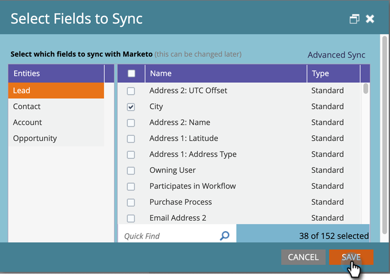

# Editando Campos para Sincronização Antes de Excluí-los em [!DNL Dynamics] {#editing-fields-to-sync-before-deleting-them-in-dynamics}

Às vezes, você pode querer excluir campos em [!DNL Dynamics]. O Marketo mantém a lista de campos como uma referência para basear a sincronização. Se um campo for excluído em [!DNL Dynamics] enquanto a sincronização estiver ativada, a sincronização poderá encontrar erros. Antes de excluir qualquer campo, siga as etapas abaixo.

1. No Marketo, clique em **[!UICONTROL Admin]**.

   

1. Em [!UICONTROL Integração], clique em **[!UICONTROL Microsoft Dynamics]**.

   

1. Clique em **[!UICONTROL Desabilitar sincronização]**.

   

1. Em uma nova guia do navegador, faça logon no [!DNL Dynamics] e exclua os campos desejados.

1. De volta ao Marketo, em [!DNL Microsoft Dynamics], clique em **[!UICONTROL Editar]** ao lado de &quot;[!UICONTROL Etapa 2: Selecionar campos para sincronização].&quot;

   

1. Revise os campos e clique em **[!UICONTROL Salvar]**.

   

>[!CAUTION]
>
>É necessário clicar em **[!UICONTROL Salvar]** para salvar o esquema atualizado para a sincronização, mesmo que nenhuma alteração tenha sido feita.

>[!NOTE]
>
>Se a Sincronização não for interrompida antes da exclusão de um campo em [!DNL Dynamics], a sincronização poderá encontrar erros. Se isso acontecer, a sincronização será interrompida. Antes de continuar, o Administrador do Marketo precisaria revisar &quot;[!UICONTROL Selecionar campos para sincronização]&quot; (discutido acima) e clicar em **[!UICONTROL Salvar]** para que a sincronização aceite as alterações do esquema.

Lembre-se de ativar a sincronização depois que as alterações forem salvas!
