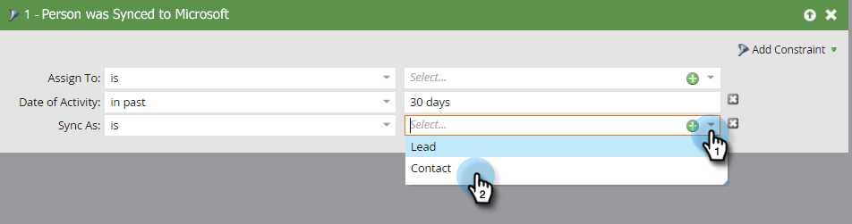

# Criar um Contato em [!DNL Microsoft Dynamics] {#create-a-contact-in-microsoft-dynamics}

1. Selecione a pessoa somente no Marketo Engage (o Tipo de Microsoft está vazio) que você deseja criar como um contato no Dynamics.

   

1. Clique em **[!UICONTROL Ações da pessoa]** e **[!DNL Microsoft]** e selecione **[!UICONTROL Sincronizar pessoa com o Microsoft]**.

   

1. Clique em **[!UICONTROL Sincronizar como]** e selecione **[!UICONTROL Contato]**. Clique em **[!UICONTROL Executar Agora]**.

   

   >[!NOTE]
   >
   >Ao usar a ação de fluxo &quot;[!UICONTROL Sincronizar Pessoa com o Microsoft]&quot; (somente em uma Campanha de Gatilho), o cliente potencial/contato será criado em tempo real no Dynamics.

1. A Marketo qualifica esse registro de Cliente Potencial em [!DNL Dynamics] para um Contato que não está associado a nenhuma Conta em [!DNL Dynamics].

   

1. Agora, você pode selecionar **[!UICONTROL Contato]** ao usar a restrição Sincronizar como em um filtro de campanha inteligente.

   
