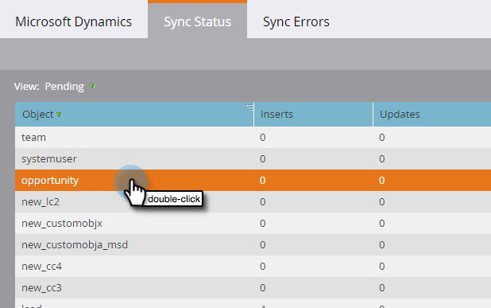

# Status da sincronização {#sync-status}

Você pode manter guias sobre a taxa de transferência e o backlog atuais do processo de sincronização nas guias Status da sincronização e Erros de sincronização.

## Guia Status de sincronização {#sync-status-tab}

1. Clique em **[!UICONTROL Admin]** e depois em **[!UICONTROL Microsoft Dynamics]**.

   

1. Clique na guia **[!UICONTROL Status de sincronização]**.

   

   Esta tabela exibe o backlog de inserções e atualizações que ainda não foram sincronizadas para cada objeto.

1. Clique duas vezes em qualquer linha para exibir as informações da oportunidade.

   

   Os detalhes do status de sincronização são divididos por inserções e atualizações, e os registros de inserção e atualização mais antigos.

   

1. Clique no menu suspenso **[!UICONTROL Exibir]** e selecione **[!UICONTROL Última Hora]** para exibir as informações de taxa de transferência.

   

   A exibição agora mostra o número de registros sincronizados na última hora completa (por exemplo, das 13h às 14h).

   

   >[!NOTE]
   >
   >Quando você estiver olhando para a visualização Última hora, as colunas Inserções e Atualizações exibem N/D. Esse é o comportamento esperado.

## Guia Erros de sincronização {#sync-errors-tab}

Procurar, pesquisar ou exportar clientes em potencial (e outros objetos) que não foram sincronizados com detalhes como operação, direção, código de erro e mensagem de erro.

>[!MORELIKETHIS]
>
>[Tipos de Notificação](/help/marketo/product-docs/core-marketo-concepts/miscellaneous/understanding-notifications/notification-types.md){target="_blank"}
