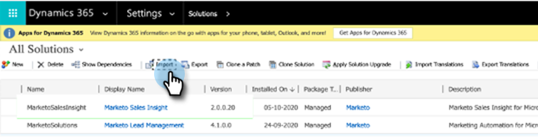
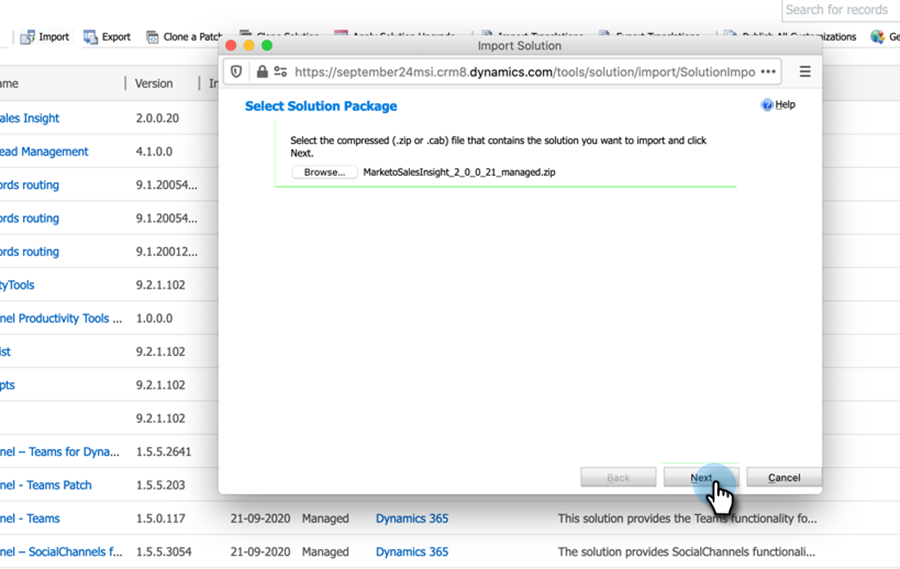
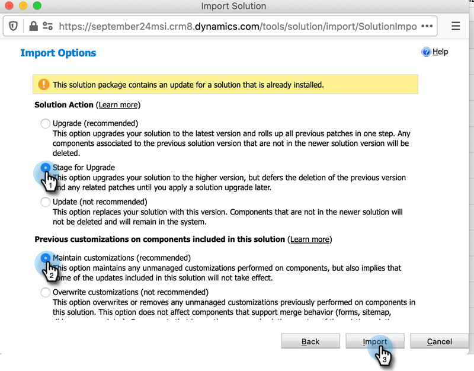
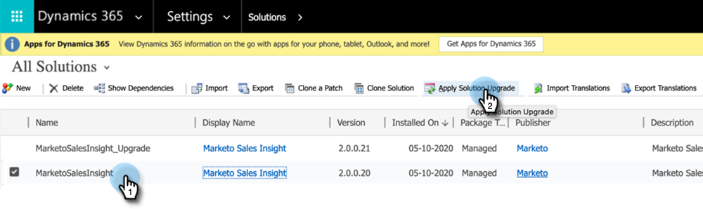
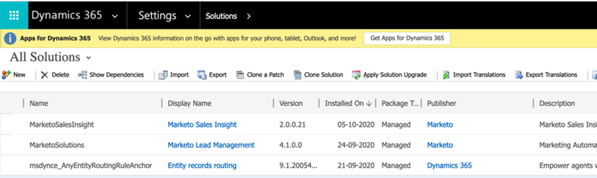

# Versões de plug-in para [!DNL Microsoft Dynamics] MSI {#plug-in-releases-for-microsoft-dynamics-msi}

Ao sincronizar pela primeira vez com o [!DNL Microsoft Dynamics], você baixará e instalará a versão mais recente dos plug-ins para o Marketo Sales Insight (MSI). Periodicamente, o Marketo atualiza esses plug-ins para que você possa retornar ao mesmo lugar para baixar a nova versão.

Se você estiver usando a solução de sincronização nativa do CRM da Marketo para [!DNL Dynamics], [baixe o plug-in mais recente](/help/marketo/product-docs/marketo-sales-insight/msi-for-microsoft-dynamics/installing/download-the-marketo-sales-insight-solution-for-microsoft-dynamics.md){target="_blank"} correspondente à sua versão do [!DNL Dynamics]. Para aqueles que têm uma sincronização personalizada e compraram o Marketo Sales Insight, o [pacote está aqui](https://mktg-cdn.marketo.com/community/MarketoSalesInsight_NonNative.zip){target="_blank"}.

>[!NOTE]
>
>Essas versões funcionam para as versões local e online do [!DNL Dynamics].

## Atualização da solução MSI {#upgrading-your-msi-solution}

1. Importe a versão mais recente da solução _sobre a versão existente_ do seu CRM [!DNL Dynamics] pressionando o botão **[!UICONTROL Importar]** no [!DNL Dynamics].

   

>[!NOTE]
>
>Exemplo: se o seu CRM do [!DNL Dynamics] tiver a versão 2.0.0.20 e a última versão for 2.0.0.21, você importaria _sobre_ a versão 2.0.0.20.

1. Clique em **[!UICONTROL Next]**.

   

1. Selecione o **[!UICONTROL Preparo para a Atualização]** e **[!UICONTROL Manter personalizações]** e clique em **[!UICONTROL Importar]**.

   

1. Clique em **[!UICONTROL Next]**.

   

1. Após uma importação bem-sucedida, duas soluções MSI serão exibidas: MarketoSalesInsight e MarketoSalesInsight_Upgrade. Selecione a solução mais antiga e clique em Aplicar atualização da solução.

   

Após a atualização, você verá apenas uma Solução MSI.

## Atualizações de versão {#version-updates}

<table>
 <tbody>
  <tr>
   <th>Data de lançamento</th>
   <th>Versão</th>
   <th>Observações</th>
  </tr>
  <tr>
   <td>02/14/24</td>
   <td>2.00.31</td>
   <td>Alterações na paginação em atividade da Web anônima.
   

   Criptografar informações da chave secreta da visualização do usuário. A senha precisa ser alterada após a importação do novo pacote para que a criptografia ocorra.
   

   Ao atualizar o plug-in do MSI para Dynamics, é recomendável atualizar a chave secreta da API do SOAP e as credenciais do MSI como uma forma de atualização para garantir que nenhuma permissão de acesso ocorra com o novo pacote que está sendo instalado.</td>
  </tr>
  <tr>
   <td>10/18/23</td>
   <td>2.00.30</td>
   <td>Consolidação do registro de erros MSI e remoção de notificações de informações para exibição na entidade de erro do Marketo.</td>
  </tr>
  <tr>
   <td>05/19/23</td>
   <td>2.00.29</td>
   <td>Correção de problemas de paginação de Atividade da Web e Momentos interessantes no painel global.</td>
  </tr>
  <tr>
   <td>03/23/23</td>
   <td>2.00.28</td>
   <td>Criado um <a href="https://mktg-cdn.marketo.com/community/MarketoSalesInsight_NonNative.zip">novo pacote</a> para MSI para conexões não nativas com o CRM.</td>
  </tr>
  <tr>
   <td>02/03/22</td>
   <td>2.0.0.27</td>
   <td>Layout de conta para Insights: momentos interessantes, alterações de pontuação, atividades da Web, atividades de email.</td>
  </tr>
  <tr>
   <td>01/05/22</td>
   <td>2.0.0.26</td>
   <td>Pontuação de adoção de programa para enviar email.</td>
  </tr>
  <tr>
   <td>10/28/21</td>
   <td>2.0.0.25</td>
   <td>Métricas de pontuação de adoção de produtos, novo Painel global (Atividade da Web, Email, Melhores opções).</td>
  </tr>
  <tr>
   <td>02/10/21</td>
   <td>2.0.0.22</td>
   <td>Remova a Auditoria automática ativada e as alterações na documentação na solução MSI.</td>
  </tr>
  <tr>
   <td>10/01/20</td>
   <td>2.0.0.21</td>
   <td>Correção de erros: atribuição de acesso aos campos de configuração da API MSI para usuários com a função Sales Insight.</td>
  </tr>
  <tr>
   <td>07/20/20</td>
   <td>2.0.0.20</td>
   <td>Correção de erros: adicione uma mensagem de validação para registros não sincronizados.</td>
  </tr>
  <tr>
   <td>06/12/20</td>
   <td>2.0.0.19</td>
   <td>Correção de erros: para ocultar a senha secreta MSI na configuração da API do MSD.</td>
  </tr>
  <tr>
   <td>05/26/20</td>
   <td>2.0.0.18</td>
   <td>Correção de erros: Para alterar a validação da ID de atribuição do MSI para exibir botões MSI.</td>
  </tr>
  <tr>
   <td>05/21/20</td>
   <td>2.0.0.17</td>
   <td>Correção de erros: reexiba o campo do proprietário e torne os campos não obrigatórios.</td>
  </tr>
  <tr>
   <td>04/28/20</td>
   <td>2.0.0.16</td>
   <td>Correção de erros: removendo a dependência do link de configuração do mapa de site do MSD CRM.</td>
  </tr>
 </tbody>
</table>
