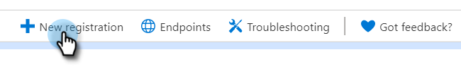
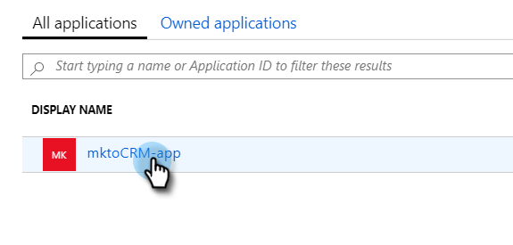
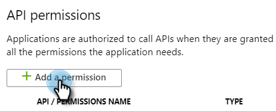
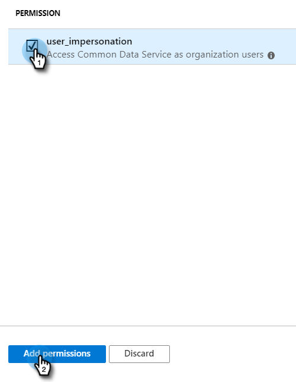

# Registrar um aplicativo com o Azure para adquirir a ID do cliente/ID do aplicativo {#register-an-app-with-azure-to-acquire-your-client-id-app-id}

O Azure Ative Diretory estende seus diretórios locais na nuvem, fornecendo suporte ao CRM do [!DNL MS Dynamics 365] com autenticação ADFS local.

## Registrando um novo aplicativo {#registering-a-new-app}

1. [Faça logon](https://login.microsoftonline.com/){target="_blank"} no portal de gerenciamento do Microsoft Azure usando uma conta com permissões de administrador. Você também pode acessar o portal Microsoft Azure por meio do Centro de Administração do Office 365, expandindo o item **[!UICONTROL Administrador]** no painel de navegação esquerdo e selecionando **[!UICONTROL Azure AD]**.

   >[!CAUTION]
   >
   >Você deve usar uma conta na mesma assinatura do [!DNL Office 365] que a conta com a qual pretende registrar o aplicativo.

   >[!NOTE]
   >
   >Se você não tiver uma conta da Azure, poderá [inscrever-se](https://azure.microsoft.com/en-us/free/){target="_blank"} para uma. Consulte a documentação da Microsoft ou entre em contato com o representante da Microsoft para obter mais informações. Depois de criar uma conta do Azure, você pode registrar um ou mais aplicativos usando o procedimento descrito abaixo.
   >
   >
   >Se você tiver uma conta da Azure, mas a sua assinatura do [!DNL Office 365] com o [!DNL Microsoft Dynamics 365] não estiver disponível na sua assinatura do Azure, siga [estas instruções](https://msdn.microsoft.com/office/office365/howto/setup-development-environment#bk_CreateAzureSubscription){target="_blank"} para associar as duas contas.

1. Localize e clique em **[!UICONTROL Azure Ative Diretory]** no painel de navegação esquerdo.

   

1. Em [!UICONTROL Gerenciar], clique em **[!UICONTROL Registros de aplicativo]**.

   

1. Clique em **[!UICONTROL Novo registro]** na parte superior da página.

   

1. Insira um nome para o aplicativo, escolha o tipo de conta aplicável e insira um URL de redirecionamento. Em seguida, clique em **[!UICONTROL Registrar]** na parte inferior da página.

   

1. Agora você deve ver seu aplicativo na guia **[!UICONTROL Registros de aplicativo]**.

   

## Configuração de permissões do aplicativo {#configuring-app-permissions}

1. Na guia **[!UICONTROL Registros de aplicativo]** do Ative Diretory, clique no aplicativo para o qual deseja configurar permissões.

   

1. Em [!UICONTROL Gerenciar], clique em **[!UICONTROL Permissões de API]**.

   

1. Clique no botão **[!UICONTROL Adicionar uma permissão]**.

   

1. Escolha o **[!UICONTROL Dynamics CRM]**.

   

1. Marque a caixa **[!UICONTROL Acessar o Common Data Service como usuários da organização]** e clique em **[!UICONTROL Adicionar permissões].**

   

1. Depois que as permissões forem adicionadas com êxito, aguarde pelo menos 10 segundos.

   

1. Clique no botão **[!UICONTROL Dar consentimento administrativo]**.

   

1. Clique em **[!UICONTROL Sim]** para confirmar.

   

   E pronto!

   
