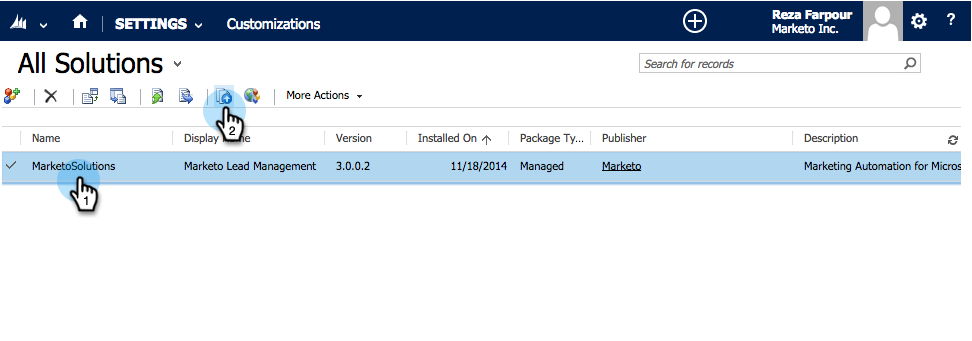

# Etapa 1 de 3: instalar a solução da Marketo no Dynamics (2013 no local) {#step-of-install-the-marketo-solution-in-dynamics-on-premises}

Antes de sincronizar o Microsoft Dynamics no local e o Marketo Engage, é necessário instalar a solução Marketo no Dynamics.

>[!NOTE]
>
>Após sincronizar o Marketo com um CRM, não é possível executar uma nova sincronização sem substituir a instância.

>[!PREREQUISITES]
>
>Você deve ter [Implantação voltada para a Internet](https://www.microsoft.com/en-us/download/confirmation.aspx?id=41701){target="_blank"} (IFD) with [Active Directory Federation Services](https://msdn.microsoft.com/en-us/library/bb897402.aspx){target="_blank"} 2.0, 2.1 ou 3.0 (ADFS) configurado. Observação: o documento IFD é baixado automaticamente quando você clica no link.
>
>[Baixar a solução da Marketo](/help/marketo/product-docs/crm-sync/microsoft-dynamics-sync/sync-setup/download-the-marketo-lead-management-solution.md){target="_blank"} antes de começar.

>[!NOTE]
>
>**Permissões de administrador do Dynamics necessárias**.
>
>Você precisa de privilégios de administrador do CRM para executar esta sincronização.

1. Faça logon no Dynamics. Clique em **[!UICONTROL Microsoft Dynamics CRM]** e selecione **[!UICONTROL Configurações]**.

   

1. Em **[!UICONTROL Configurações]**, selecione **[!UICONTROL Soluções]**.

   

1. Clique em **[!UICONTROL Importar]**.

   

1. Clique em **[!UICONTROL Procurar]** e selecione o [solução baixada](/help/marketo/product-docs/crm-sync/microsoft-dynamics-sync/sync-setup/download-the-marketo-lead-management-solution.md){target="_blank"}. Clique em **[!UICONTROL Próximo]**.

   

1. Exiba as Informações da Solução e clique em **[!UICONTROL Exibir detalhes do pacote de soluções]**.

   

1. Quando terminar de verificar todos os detalhes, clique em **[!UICONTROL Fechar]**.

   

1. Na página Informações da solução, clique em **[!UICONTROL Próxima]**.

   

1. Verifique se a opção SDK está marcada. Clique em **[!UICONTROL Importar]**.

   

1. Aguarde a conclusão da importação.

   >[!TIP]
   >
   >Você precisará ativar os pop-ups no seu navegador para concluir o processo de instalação.

   

1. Baixe um arquivo de log (se desejar) e clique em **[!UICONTROL Fechar]**.

   >[!NOTE]
   >
   >Você pode ver uma mensagem dizendo &quot;O Gerenciamento de clientes potenciais da Marketo foi concluído com aviso&quot;. Isso é totalmente esperado.

   

1. O Gerenciamento de clientes potenciais da Marketo agora aparecerá no **[!UICONTROL Todas as soluções]** página.

   

1. Selecione a solução da Marketo e clique em **[!UICONTROL Publicar todas as personalizações]**.

   

>[!CAUTION]
>
>Desativar qualquer um dos processos de mensagens do SDK do Marketo resultará em uma instalação corrompida!

>[!MORELIKETHIS]
>
>[Etapa 2 de 3: Configurar usuário de sincronização para o Marketo (2013 no local)](/help/marketo/product-docs/crm-sync/microsoft-dynamics-sync/sync-setup/connecting-to-legacy-versions/step-2-of-3-configure-2013.md){target="_blank"}
