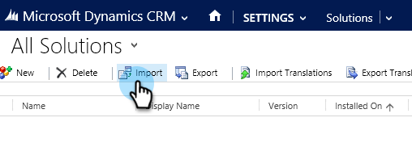

# Etapa 1 de 3: Configurar usuário de sincronização para o Marketo (2015 no local) {#step-of-configure-sync-user-for-marketo-on-premises-2015}

Antes de sincronizar o Microsoft Dynamics 2015 no local com o Marketo Engage, é necessário instalar a solução Marketo no Dynamics.

>[!NOTE]
>
>Depois de sincronizar o Marketo com um CRM, você não pode sincronizar um novo CRM com a instância existente do Marketo.

>[!PREREQUISITES]
>
>Se estiver usando o Microsoft Dynamics no Local, você deve ter o [Implantação para a Internet](https://learn.microsoft.com/en-us/dynamics365/customerengagement/on-premises/deploy/configure-an-internet-facing-deployment){target="_blank"} (IFD) com o [Serviços de Federação do Ative Diretory](https://msdn.microsoft.com/en-us/library/bb897402.aspx){target="_blank"} 2.0+ (ADFS) configurado. Observação: o documento IFD é baixado automaticamente quando você clica no link.
>
>[Baixe a Solução de Gerenciamento de Clientes Potenciais da Marketo](/help/marketo/product-docs/crm-sync/microsoft-dynamics-sync/sync-setup/download-the-marketo-lead-management-solution.md){target="_blank"} antes de começar.

>[!NOTE]
>
>**Permissões de Administrador do Dynamics necessárias**.
>
>Você precisa de privilégios de administrador do CRM para executar esta sincronização.

1. Faça logon no Dynamics. Clique no menu suspenso **[!UICONTROL Microsoft Dynamics CRM]** e selecione **[!UICONTROL Configurações]**.

   

1. Em **[!UICONTROL Configurações]**, selecione **[!UICONTROL Soluções]**.

   

1. Clique em **[!UICONTROL Importar]**.

   

1. Clique em **[!UICONTROL Procurar]** e selecione a solução que você [baixou](/help/marketo/product-docs/crm-sync/microsoft-dynamics-sync/sync-setup/download-the-marketo-lead-management-solution.md). Clique em **[!UICONTROL Avançar]**.

   

1. Exiba as Informações da Solução e clique em **[!UICONTROL Exibir detalhes do pacote da solução]**.

   

1. Quando terminar de verificar todos os detalhes, clique em **[!UICONTROL Fechar]**.

   

1. Na página Informações da solução, clique em **[!UICONTROL Avançar]**.

   

1. Verifique se a caixa de seleção da opção SDK está marcada. Clique em **[!UICONTROL Importar]**.

   

1. Aguarde a conclusão da importação.

   >[!TIP]
   >
   >Você precisará ativar os pop-ups no seu navegador para concluir o processo de instalação.

   

1. Baixe um arquivo de log (se desejar) e clique em **[!UICONTROL Fechar]**.

   >[!NOTE]
   >
   >Você pode ver uma mensagem dizendo &quot;O Gerenciamento de clientes potenciais da Marketo foi concluído com aviso&quot;. Isso é totalmente esperado.

   

1. O Gerenciamento de Clientes Potenciais da Marketo agora aparecerá na página **[!UICONTROL Todas as Soluções]**.

   

1. Selecione a solução da Marketo e clique em **[!UICONTROL Publicar todas as personalizações]**.

   

   Bom trabalho! A instalação foi concluída.

   >[!CAUTION]
   >
   >Desativar qualquer um dos processos de mensagens do Marketo SDK resultará em uma instalação corrompida!

   >[!MORELIKETHIS]
   >
   >[Instalar o Marketo para Microsoft Dynamics 2015 no Local Etapa 2 de 3](/help/marketo/product-docs/crm-sync/microsoft-dynamics-sync/sync-setup/connecting-to-legacy-versions/step-2-of-3-set-up-2015.md){target="_blank"}
