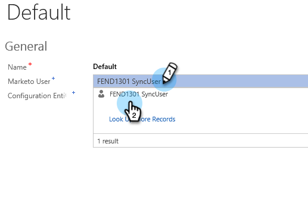

# Etapa 2 de 3: Configurar usuário de sincronização para o Marketo (2013 no local) {#step-of-configure-sync-user-for-marketo-on-premises}

Ótimo trabalho completando as etapas anteriores, vamos continuar percorrendo isso.

>[!PREREQUISITES]
>
>[Etapa 1 de 3: instalar a solução da Marketo no Dynamics (2013 no local)](/help/marketo/product-docs/crm-sync/microsoft-dynamics-sync/sync-setup/connecting-to-legacy-versions/step-1-of-3-install-2013.md){target="_blank"}

## Atribuir Função de Usuário de Sincronização {#assign-sync-user-role}

Atribua a função de Usuário de sincronização do Marketo somente ao usuário de sincronização do Marketo. Você não precisa atribuí-lo a nenhum outro usuário.

>[!NOTE]
>
>Isso se aplica ao plug-in do Marketo versão 4.0.0.14 e posterior. Para versões anteriores, todos os usuários devem ter a função de usuário sincronizar. Para atualizar o Marketo, consulte [Atualizar a solução Marketo para Microsoft Dynamics](/help/marketo/product-docs/crm-sync/microsoft-dynamics-sync/sync-setup/update-the-marketo-solution-for-microsoft-dynamics.md){target="_blank"}.

>[!IMPORTANT]
>
>A configuração de idioma do Usuário de sincronização [deve ser definido como inglês](https://portal.dynamics365support.com/knowledgebase/article/KA-01201/en-us){target="_blank"}.

1. Em **Configurações**, clique em **Administração**.

   

1. Selecionar **Usuários**.

   

1. Você verá uma lista de usuários aqui. Selecione seu usuário dedicado do Marketo Sync ou entre em contato com [Serviços de Federação do Ative Diretory (AFDS)](https://msdn.microsoft.com/en-us/library/bb897402.aspx){target="_blank"} administrator to create a new user that's [dedicated to Marketo](https://blogs.technet.com/b/askpfeplat/archive/2014/04/21/introduction-to-active-directory-federation-services-ad-fs-alternateloginid-feature.aspx){target="_blank"}.

   

1. Selecione o usuário de sincronização. Clique em  e selecione **[!UICONTROL Gerenciar Funções]**.

   

1. Marcar **[!UICONTROL Usuário de sincronização do Marketo]** e clique em **[!UICONTROL OK]**.

   

   >[!TIP]
   >
   >Se você não vir a função, volte para [etapa 1 de 3](/help/marketo/product-docs/crm-sync/microsoft-dynamics-sync/sync-setup/connecting-to-legacy-versions/step-1-of-3-install-2013.md){target="_blank"} e importe a solução.

   >[!NOTE]
   >
   >Quaisquer atualizações feitas em seu CRM pelo Usuário do Sync _não_ ser sincronizado com o Marketo.

## Configurar a solução da Marketo {#configure-marketo-solution}

Quase pronto! Temos apenas algumas últimas configurações antes de passar para o próximo artigo.

1. Em **[!UICONTROL Configurações]**, clique em **[!UICONTROL Configuração do Marketo]**.

   

   >[!NOTE]
   >
   >Se a &quot;Configuração do Marketo&quot; estiver ausente, tente atualizar a página. Se o problema persistir, [publicar a solução da Marketo](/help/marketo/product-docs/crm-sync/microsoft-dynamics-sync/sync-setup/connecting-to-legacy-versions/step-1-of-3-install-2013.md) novamente ou tente fazer logoff e logon novamente.

1. Clique em **[!UICONTROL Padrão]**.

   

1. Clique em **[!UICONTROL Usuário do Marketo]** e selecione o usuário de sincronização.

   

1. Clique em  no canto inferior direito para salvar as alterações.

   

1. Clique em **[!UICONTROL Publicar todas as personalizações]**.

   

## Antes de prosseguir para a Etapa 3 {#before-proceeding-to-step}

* Se quiser restringir o número de registros sincronizados, [configurar um filtro de sincronização personalizado](/help/marketo/product-docs/crm-sync/microsoft-dynamics-sync/create-a-custom-dynamics-sync-filter.md){target="_blank"} agora.
* Execute o [Validar a sincronização do Microsoft Dynamics](/help/marketo/product-docs/crm-sync/microsoft-dynamics-sync/sync-setup/validate-microsoft-dynamics-sync.md){target="_blank"} processo. Ele verifica se as configurações iniciais foram feitas corretamente.
* Faça logon no Usuário do Marketo Sync no Microsoft Dynamics CRM.

Excelente trabalho!

>[!MORELIKETHIS]
>
>[Etapa 3 de 3: Conectar o Marketo e o Dynamics (2013 no local)](/help/marketo/product-docs/crm-sync/microsoft-dynamics-sync/sync-setup/connecting-to-legacy-versions/step-3-of-3-connect-2013.md){target="_blank"}
