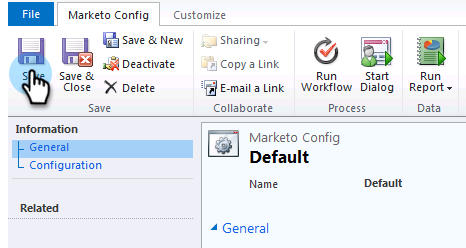

# Etapa 2 de 3: Configurar o usuário do Marketo Sync no Dynamics (2011 no local) {#step-of-set-up-marketo-sync-user-in-dynamics-on-premises}

Excelente trabalho ao concluir as etapas anteriores, vamos continuar avançando nisso.

>[!PREREQUISITES]
>
>[Etapa 1 de 3: Instalar a solução Marketo (2011 no local)](/help/marketo/product-docs/crm-sync/microsoft-dynamics-sync/sync-setup/connecting-to-legacy-versions/step-1-of-3-install-2011.md)

## Atribuir Função de Usuário de Sincronização {#assign-sync-user-role}

Atribua a função Usuário de sincronização do Marketo somente ao usuário de sincronização do Marketo. Não é necessário atribuí-lo a nenhum outro usuário.

>[!NOTE]
>
>Isso se aplica ao plug-in Marketo versão 4.0.0.14 e posterior. Para versões anteriores, todos os usuários devem ter a função de sincronização do usuário. Para atualizar o Marketo, consulte [Atualizar a solução Marketo para o Microsoft Dynamics](/help/marketo/product-docs/crm-sync/microsoft-dynamics-sync/sync-setup/update-the-marketo-solution-for-microsoft-dynamics.md).

>[!IMPORTANT]
>
>A configuração de idioma do Usuário de sincronização [deve ser definido como inglês](https://portal.dynamics365support.com/knowledgebase/article/KA-01201/en-us).

1. No menu inferior esquerdo, selecione **Configurações**.

   

1. Na árvore, selecione **Administração**.

   

1. Selecionar **Usuários**.

   

1. Você verá uma lista de usuários aqui. Selecione seu usuário dedicado de sincronização do Marketo ou entre em contato com seu [Serviços de Federação do Ative Diretory (AFDS)](https://msdn.microsoft.com/en-us/library/bb897402.aspx) administrador para criar um novo usuário dedicado ao Marketo. Clique em **Gerenciar funções**.

   

1. Verificar **Usuário do Marketo Sync** e clique em **OK**.

   

   >[!TIP]
   >
   >Se você não vir a função, volte para [etapa 1 de 3](/help/marketo/product-docs/crm-sync/microsoft-dynamics-sync/sync-setup/connecting-to-legacy-versions/step-1-of-3-install-2011.md) e importe a solução.

   >[!NOTE]
   Qualquer atualização feita em seu CRM pelo Usuário de sincronização **not** ser sincronizado de volta ao Marketo.

## Configurar a solução Marketo {#configure-marketo-solution}

Quase pronto! Temos apenas algumas últimas partes da configuração antes de passar para o próximo artigo.

1. Selecionar **Configurações**. Em seguida, selecione **Configuração do Marketo** na árvore.

   

   >[!NOTE]
   Se a configuração do Marketo estiver ausente, tente atualizar a página. Se o problema persistir, [publicar a solução Marketo novamente](/help/marketo/product-docs/crm-sync/microsoft-dynamics-sync/sync-setup/connecting-to-legacy-versions/step-1-of-3-install-2011.md) ou faça logoff e volte.

1. Clique em **Padrão**.

   

1. Clique em 

   

1. Na janela pop-up , selecione o usuário de sincronização. Em seguida, clique em **OK**.

   

1. Clique em **Salvar** para salvar as alterações.

   

1. Clique em **Publicar todas as personalizações**.

   

## Antes de prosseguir para a Etapa 3 {#before-proceeding-to-step}

    * Se quiser restringir o número de registros sincronizados, [configure um filtro de sincronização personalizado](/help/marketo/product-docs/crm-sync/microsoft-dynamics-sync/create-a-custom-dynamics-sync-filter.md) agora.
    * Execute o processo [Validar o Microsoft Dynamics Sync](/help/marketo/product-docs/crm-sync/microsoft-dynamics-sync/sync-setup/validate-microsoft-dynamics-sync.md). Ele verifica se as configurações iniciais foram feitas corretamente.
    * Efetue logon no usuário de sincronização do Marketo no Microsoft Dynamics CRM.

Muito bem!

>[!MORELIKETHIS]
[Etapa 3 de 3: Conectar o Microsoft Dynamics ao Marketo (2011 no local)](/help/marketo/product-docs/crm-sync/microsoft-dynamics-sync/sync-setup/connecting-to-legacy-versions/step-3-of-3-connect.md)
