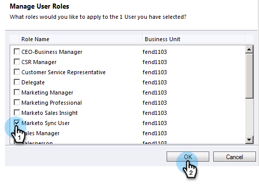
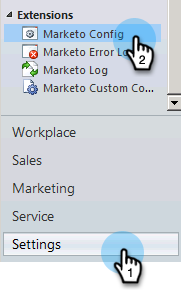

# Etapa 2 de 3: Configurar o usuário do Marketo Sync no Dynamics (2011 no local) {#step-of-set-up-marketo-sync-user-in-dynamics-on-premises}

Excelente trabalho ao concluir as etapas anteriores, vamos continuar avançando nisso.

>[!PREREQUISITES]
>
>[Etapa 1 de 3: Instalar a solução Marketo (2011 no local)](/help/marketo/product-docs/crm-sync/microsoft-dynamics-sync/sync-setup/microsoft-dynamics-2011-on-premises/step-1-of-3-install.md)

## Atribuir Função de Usuário de Sincronização {#assign-sync-user-role}

Atribua a função Usuário de sincronização do Marketo somente ao usuário de sincronização do Marketo. Não é necessário atribuí-lo a nenhum outro usuário.

>[!NOTE]
>
>This applies to Marketo plugin version 4.0.0.14 and later. Para versões anteriores, todos os usuários devem ter a função de sincronização do usuário. To upgrade Marketo, see [Upgrade the Marketo Solution for Microsoft Dynamics](/help/marketo/product-docs/crm-sync/microsoft-dynamics-sync/sync-setup/update-the-marketo-solution-for-microsoft-dynamics.md).

>[!IMPORTANT]
>
>The language setting of the Sync User [should be set to English](https://portal.dynamics365support.com/knowledgebase/article/KA-01201/en-us).

1. No menu inferior esquerdo, selecione **Configurações**.

   

1. Na árvore, selecione **Administração**.

   

1. Select **Users**.

   

1. You will see a list of users here. Select your dedicated Marketo sync user or contact your [Active Directory Federation Services (AFDS)](https://msdn.microsoft.com/en-us/library/bb897402.aspx) administrator to create a new user that&#39;s dedicated to Marketo. Clique em **Gerenciar funções**.

   

1. Verificar **Usuário do Marketo Sync** e clique em **OK**.

   

   >[!TIP]
   >
   >If you don&#39;t see the role, go back to [step 1 of 3](/help/marketo/product-docs/crm-sync/microsoft-dynamics-sync/sync-setup/microsoft-dynamics-2011-on-premises/step-1-of-3-install.md) and import the solution.

   >[!NOTE]
   >
   >Qualquer atualização feita em seu CRM pelo Usuário de sincronização **not** ser sincronizado de volta ao Marketo.

## Configurar a solução Marketo {#configure-marketo-solution}

Quase pronto! Temos apenas algumas últimas partes da configuração antes de passar para o próximo artigo.

1. Selecionar **Configurações**. Then select **Marketo Config** in the tree.

   

   >[!NOTE]
   >
   >Se a configuração do Marketo estiver ausente, tente atualizar a página. Se o problema persistir, [publicar a solução Marketo novamente](/help/marketo/product-docs/crm-sync/microsoft-dynamics-sync/sync-setup/microsoft-dynamics-2011-on-premises/step-1-of-3-install.md) ou faça logoff e volte.

1. Clique em **Padrão**.

   

1. Click on 

   

1. Na janela pop-up , selecione o usuário de sincronização. Then click **OK**.

   

1. Clique em **Salvar** para salvar as alterações.

   

1. Click **Publish All Customizations**.

   

## Antes de prosseguir para a Etapa 3 {#before-proceeding-to-step}

    * Se quiser restringir o número de registros sincronizados, [configure um filtro de sincronização personalizado](/help/marketo/product-docs/crm-sync/microsoft-dynamics-sync/create-a-custom-dynamics-sync-filter.md) agora.
    * Execute o processo [Validar o Microsoft Dynamics Sync](/help/marketo/product-docs/crm-sync/microsoft-dynamics-sync/sync-setup/validate-microsoft-dynamics-sync.md). Ele verifica se as configurações iniciais foram feitas corretamente.
    * Efetue logon no usuário de sincronização do Marketo no Microsoft Dynamics CRM.

Muito bem!

>[!MORELIKETHIS]
>
>[Step 3 of 3: Connect Microsoft Dynamics with Marketo (2011 On-Premises)](/help/marketo/product-docs/crm-sync/microsoft-dynamics-sync/sync-setup/microsoft-dynamics-2011-on-premises/step-3-of-3-connect.md)
