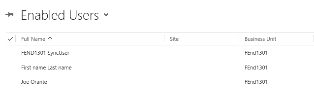

# Etapa 2 de 3 Configurar o Marketo para Dynamics (2015 no local){#step-of-set-up-for-marketo-on-premises-2015}

Excelente trabalho ao concluir as etapas anteriores. Vamos continuar a passar por isto.

>[!PREREQUISITES]
>
>[Instale o Marketo para Microsoft Dynamics 2015 no local Etapa 1 de 3](/help/marketo/product-docs/crm-sync/microsoft-dynamics-sync/sync-setup/connecting-to-legacy-versions/step-1-of-3-install-2015.md)

## Atribuir Função de Usuário de Sincronização {#assign-sync-user-role}

Atribua a função Usuário de sincronização do Marketo somente ao usuário de sincronização do Marketo. Não é necessário atribuí-lo a nenhum outro usuário.

>[!NOTE]
>
>Isso se aplica ao Marketo versão 4.0.0.14 e posterior. Para versões anteriores, todos os usuários devem ter a função de sincronização do usuário. Para atualizar sua Marketo, consulte [Atualizar a solução Marketo para o Microsoft Dynamics](/help/marketo/product-docs/crm-sync/microsoft-dynamics-sync/sync-setup/update-the-marketo-solution-for-microsoft-dynamics.md).

>[!IMPORTANT]
>
>A configuração de idioma do Usuário de sincronização [deve ser definido como inglês](https://portal.dynamics365support.com/knowledgebase/article/KA-01201/en-us).

1. Em **Configurações**, clique em **Segurança**.

   

1. Clique em **Usuários**.

   

1. Você verá uma lista de usuários aqui. Selecione o usuário dedicado do Marketo Sync ou entre em contato com seu [Serviços de Federação do Ative Diretory](https://msdn.microsoft.com/en-us/library/bb897402.aspx)Administrador do (ADFS) para criar um usuário dedicado ao Marketo.

   

1. Selecione o usuário de sincronização. Clique em **Gerenciar funções**.

   

   Marque Marketo Sync User (Usuário de sincronização do) e clique em OK.

   

   >[!TIP]
   >
   >Se você não vir a função, volte para [etapa 1 de 3](/help/marketo/product-docs/crm-sync/microsoft-dynamics-sync/sync-setup/connecting-to-legacy-versions/step-1-of-3-install-2015.md) e importe a solução.

   >[!NOTE]
   >
   >Qualquer atualização feita em seu CRM pelo Usuário de sincronização **not** ser sincronizado de volta ao Marketo.

## Configurar a solução Marketo {#configure-marketo-solution}

Quase pronto! Temos apenas algumas últimas partes da configuração antes de passar para o próximo artigo.

1. Em **Configurações**, clique em **Configuração do Marketo**.

   

   >[!NOTE]
   >
   >Se a configuração do Marketo estiver ausente, tente atualizar a página. Se o problema persistir, [publicar a solução Marketo](/help/marketo/product-docs/crm-sync/microsoft-dynamics-sync/sync-setup/connecting-to-legacy-versions/step-1-of-3-install-2015.md) ou tente sair e voltar.

1. Clique em **Padrão**.

   

1. Clique no botão **Usuário do Marketo** e selecione o usuário de sincronização.

   

1. Clique no ícone Save no canto inferior direito.

   

1. Clique em **Publicar todas as personalizações**.

   

## Antes de prosseguir para a Etapa 3 {#before-proceeding-to-step}

* Se quiser restringir o número de registros sincronizados, [configurar um filtro de sincronização personalizado](/help/marketo/product-docs/crm-sync/microsoft-dynamics-sync/create-a-custom-dynamics-sync-filter.md) agora.
* Execute o [Validar a sincronização do Microsoft Dynamics](/help/marketo/product-docs/crm-sync/microsoft-dynamics-sync/sync-setup/validate-microsoft-dynamics-sync.md) processo. Ele verifica se as configurações iniciais foram feitas corretamente.
* Faça logon no usuário do Marketo Sync no Microsoft Dynamics CRM.

>[!MORELIKETHIS]
>
>[Instale o Marketo para Microsoft Dynamics 2015 no local Etapa 3 de 3](/help/marketo/product-docs/crm-sync/microsoft-dynamics-sync/sync-setup/connecting-to-legacy-versions/step-3-of-3-connect-2015.md)
