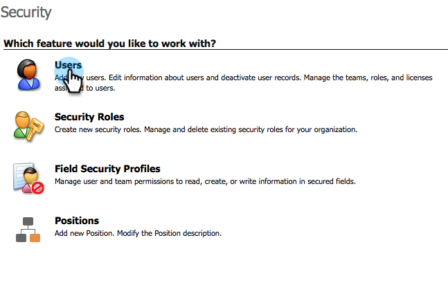

# Etapa 2 de 3 Configurar o Marketo for Dynamics (2015 no local){#step-of-set-up-for-marketo-on-premises-2015}

Ótimo trabalho para concluir as etapas anteriores. Vamos continuar passando por isso.

>[!PREREQUISITES]
>
>[Instalar o Marketo para Microsoft Dynamics 2015 no Local Etapa 1 de 3](/help/marketo/product-docs/crm-sync/microsoft-dynamics-sync/sync-setup/connecting-to-legacy-versions/step-1-of-3-install-2015.md)

## Atribuir Função de Usuário de Sincronização {#assign-sync-user-role}

Atribua a função de Usuário de sincronização do Marketo somente ao usuário de sincronização do Marketo. Você não precisa atribuí-lo a nenhum outro usuário.

>[!NOTE]
>
>Isso se aplica à versão 4.0.0.14 e posterior do Marketo. Para versões anteriores, todos os usuários devem ter a função de usuário sincronizar. Para atualizar o Marketo, consulte [Atualizar a solução Marketo para Microsoft Dynamics](/help/marketo/product-docs/crm-sync/microsoft-dynamics-sync/sync-setup/update-the-marketo-solution-for-microsoft-dynamics.md).

>[!IMPORTANT]
>
>A configuração de idioma do Usuário de sincronização [deve ser definido como inglês](https://portal.dynamics365support.com/knowledgebase/article/KA-01201/en-us).

1. Em **Configurações**, clique em **Segurança**.

   

1. Clique em **Usuários**.

   

1. Você verá uma lista de usuários aqui. Selecione o usuário Marketo Sync dedicado ou entre em contato com [Serviços de Federação do Ative Diretory](https://msdn.microsoft.com/en-us/library/bb897402.aspx)(ADFS) para criar um usuário dedicado para o Marketo.

   

1. Selecione o usuário de sincronização. Clique em **Gerenciar Funções**.

   

1. Marque Marketo Sync User e clique em **OK**.

   

   >[!IMPORTANT]
   >
   >O usuário de sincronização deve ter permissão de leitura para a configuração do Marketo.

   >[!TIP]
   >
   >Se você não vir a função, volte para [etapa 1 de 3](/help/marketo/product-docs/crm-sync/microsoft-dynamics-sync/sync-setup/connecting-to-legacy-versions/step-1-of-3-install-2015.md) e importe a solução.

   >[!NOTE]
   >
   >Quaisquer atualizações feitas em seu CRM pelo Usuário do Sync **não** ser sincronizado com o Marketo.

## Configurar a solução da Marketo {#configure-marketo-solution}

Quase pronto! Temos apenas algumas últimas configurações antes de passar para o próximo artigo.

1. Em **Configurações**, clique em **Configuração do Marketo**.

   

   >[!NOTE]
   >
   >Se a Configuração do Marketo estiver ausente, tente atualizar a página. Se o problema persistir, [publicar a solução da Marketo](/help/marketo/product-docs/crm-sync/microsoft-dynamics-sync/sync-setup/connecting-to-legacy-versions/step-1-of-3-install-2015.md) ou tente fazer logout e login novamente.

1. Clique em **Padrão**.

   

1. Clique em **Usuário do Marketo** e selecione o usuário de sincronização.

   

1. Clique no ícone de salvar no canto inferior direito.

   

1. Clique em **Publicar todas as personalizações**.

   

   >[!NOTE]
   >
   >O usuário de sincronização deve ter permissão de leitura para a configuração do Marketo.

## Antes de prosseguir para a Etapa 3 {#before-proceeding-to-step}

* Se quiser restringir o número de registros sincronizados, [configurar um filtro de sincronização personalizado](/help/marketo/product-docs/crm-sync/microsoft-dynamics-sync/create-a-custom-dynamics-sync-filter.md) agora.
* Execute o [Validar a sincronização do Microsoft Dynamics](/help/marketo/product-docs/crm-sync/microsoft-dynamics-sync/sync-setup/validate-microsoft-dynamics-sync.md) processo. Ele verifica se as configurações iniciais foram feitas corretamente.
* Faça logon no Usuário do Marketo Sync no Microsoft Dynamics CRM.

>[!MORELIKETHIS]
>
>[Instalar o Marketo para Microsoft Dynamics 2015 no Local Etapa 3 de 3](/help/marketo/product-docs/crm-sync/microsoft-dynamics-sync/sync-setup/connecting-to-legacy-versions/step-3-of-3-connect-2015.md)
