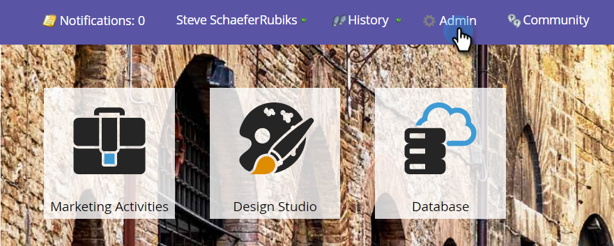
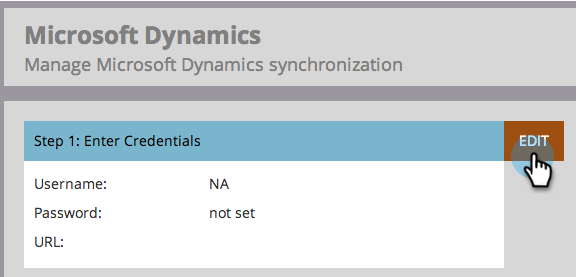
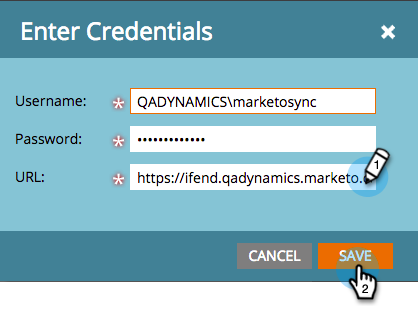

# Etapa 3 de 3: Conectar o [!DNL Microsoft Dynamics] ao Marketo (2011 no Local) {#step-of-connect-microsoft-dynamics-with-marketo-on-premises}

A solução está instalada e o usuário de sincronização está configurado. Em seguida, conecte o Marketo e o [!DNL Dynamics].

>[!PREREQUISITES]
>
>* [Etapa 1 de 3: instalar a solução da Marketo (2011 no local)](/help/marketo/product-docs/crm-sync/microsoft-dynamics-sync/sync-setup/connecting-to-legacy-versions/step-1-of-3-install-2011.md)
>* [Etapa 2 de 3: Configurar o Usuário de Sincronização do Marketo em [!DNL Dynamics] (2011 no Local)](/help/marketo/product-docs/crm-sync/microsoft-dynamics-sync/sync-setup/connecting-to-legacy-versions/step-2-of-3-set-up-2011.md)

>[!NOTE]
>
>**Permissões de administrador são necessárias**

## Inserir Informações de Usuário de Sincronização [!DNL Dynamics] {#enter-dynamics-sync-user-information}

1. Faça logon no Marketo e clique em **[!UICONTROL Admin]**.

   

1. Clique em **[!UICONTROL CRM]**.

   

1. Clique em **[!UICONTROL Microsoft]**.

   

1. Clique em **[!UICONTROL Editar]** em **[!UICONTROL Etapa 1: Inserir credenciais]**.

   

   >[!CAUTION]
   >
   >Verifique se suas credenciais estão corretas. As alterações subsequentes no esquema não podem ser revertidas após o envio. Se credenciais incorretas forem salvas, uma nova assinatura do Marketo será necessária.

1. Insira o **[!UICONTROL Nome de Usuário]**, **[!UICONTROL Senha]** e a **[!UICONTROL URL]** do CRM e clique em **[!UICONTROL Salvar]**.

   

   >[!NOTE]
   >
   >* O [!UICONTROL Nome de Usuário] no Marketo deve corresponder ao Nome de Usuário para o usuário de sincronização no CRM. O formato pode ser `user@domain.com` ou DOMÍNIO\usuário.
   >* Se você não souber a URL, [saiba como encontrá-la aqui](/help/marketo/product-docs/crm-sync/microsoft-dynamics-sync/sync-setup/view-the-organization-service-url.md).

## Selecionar campos para a sincronização {#select-fields-to-sync}

Selecione os campos a serem sincronizados.

1. Clique em **[!UICONTROL Editar]** em **[!UICONTROL Etapa 2: Selecionar campos a serem sincronizados]**.

   

1. Há campos pré-selecionados que serão sincronizados. Adicione mais se desejar e clique em **[!UICONTROL Salvar]**.

   

   >[!NOTE]
   >
   >O Marketo armazena uma referência aos campos a serem sincronizados. Se você excluir um campo em [!DNL Dynamics], recomendamos fazê-lo com a [sincronização desabilitada](/help/marketo/product-docs/crm-sync/salesforce-sync/enable-disable-the-salesforce-sync.md). Em seguida, atualize o esquema no Marketo editando e salvando os [Selecionar campos para sincronização](/help/marketo/product-docs/crm-sync/microsoft-dynamics-sync/microsoft-dynamics-sync-details/microsoft-dynamics-sync-field-sync/editing-fields-to-sync-before-deleting-them-in-dynamics.md).

## Sincronizar campos para um filtro personalizado {#sync-fields-for-a-custom-filter}

Se você criou um filtro personalizado, acesse e selecione os novos campos que serão sincronizados com o Marketo.

1. Vá para Admin e selecione **[!UICONTROL Microsoft Dynamics]**.

   

1. Clique em **[!UICONTROL Editar]** em [!UICONTROL Detalhes da sincronização de campo].

   

1. Role para baixo até o campo e marque-o. O nome real deve ser new_synctomkto, mas o Nome de exibição pode ser qualquer item. Clique em **[!UICONTROL Salvar]**.

   

## Ativar sincronização {#enable-sync}

1. Clique em **[!UICONTROL Editar]** em **[!UICONTROL Etapa 3: Habilitar Sincronização]**.

   

   >[!CAUTION]
   >
   >A Marketo não desduplicará automaticamente em uma sincronização do [!DNL Microsoft Dynamics] ou quando você inserir pessoas ou clientes potenciais manualmente.

1. Leia tudo na janela pop-up, insira seu email e clique em **[!UICONTROL Iniciar sincronização]**.

   

1. Dependendo do número de registros, a sincronização inicial pode levar de algumas horas a alguns dias. Você receberá uma notificação por e-mail após a conclusão.

   
