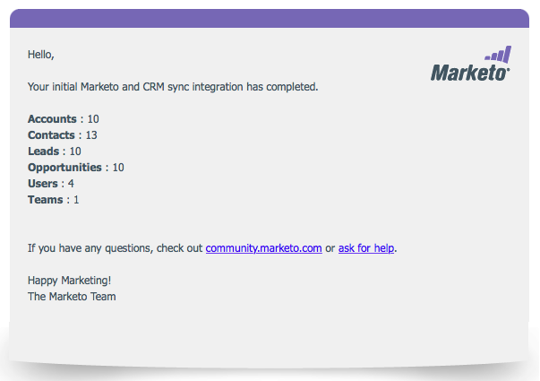

# Etapa 3 de 3: Conectar o Marketo e [!DNL Dynamics] (2013 no Local) {#step-of-connect-marketo-and-dynamics-on-premises}

Tudo bem! Instalamos a solução e configuramos o usuário de sincronização. Em seguida, precisamos conectar o Marketo e [!DNL Dynamics].

>[!PREREQUISITES]
>
>* [Etapa 1 de 3: instalar a Solução da Marketo em [!DNL Dynamics] (2013 no Local)](/help/marketo/product-docs/crm-sync/microsoft-dynamics-sync/sync-setup/connecting-to-legacy-versions/step-1-of-3-install-2013.md)
>* [Etapa 2 de 3: Configurar Usuário de Sincronização para Marketo (2013 No Local)](/help/marketo/product-docs/crm-sync/microsoft-dynamics-sync/sync-setup/connecting-to-legacy-versions/step-2-of-3-configure-2013.md)

>[!NOTE]
>
>**Permissões de administrador necessárias**

## Inserir Informações de Usuário de Sincronização [!DNL Dynamics] {#enter-dynamics-sync-user-information}

1. Faça logon no Marketo e clique em **[!UICONTROL Admin]**.

   

1. Clique em **[!UICONTROL CRM]**.

   

1. Selecione **[!DNL Microsoft]**.

   

1. Clique em **[!UICONTROL Editar]** em **[!UICONTROL Etapa 1: Inserir credenciais]**.

   

   >[!CAUTION]
   >
   >Verifique se suas credenciais estão corretas, pois não é possível reverter as alterações subsequentes no esquema após o envio. Se credenciais incorretas forem salvas, será necessário obter uma nova assinatura do Marketo.

1. Insira o **[!UICONTROL Nome de Usuário]**, **[!UICONTROL Senha]** e [!DNL Microsoft Dynamics] **URL** e clique em **[!UICONTROL Salvar]**.

   

   >[!NOTE]
   >
   >* O Nome de Usuário no Marketo deve corresponder ao Nome de Usuário para o usuário de sincronização no CRM. O formato pode ser `user@domain.com` ou DOMÍNIO\usuário.
   >* Se você não souber a URL, [saiba como encontrá-la aqui](/help/marketo/product-docs/crm-sync/microsoft-dynamics-sync/sync-setup/view-the-organization-service-url.md){target="_blank"}.

## Selecionar campos para a sincronização {#select-fields-to-sync}

Agora precisamos selecionar os campos que queremos sincronizar.

1. Clique em **[!UICONTROL Editar]** em **[!UICONTROL Etapa 2: Selecionar campos a serem sincronizados]**.

   

1. Selecione os campos que deseja sincronizar com o Marketo para que sejam pré-selecionados. Clique em **[!UICONTROL Salvar]**.

   

   >[!NOTE]
   >
   >O Marketo armazena uma referência aos campos a serem sincronizados. Se você excluir um campo em [!DNL Dynamics], recomendamos fazê-lo com a [sincronização desabilitada](/help/marketo/product-docs/crm-sync/salesforce-sync/enable-disable-the-salesforce-sync.md). Em seguida, atualize o esquema no Marketo editando e salvando os [[!UICONTROL Selecionar campos para sincronização]](/help/marketo/product-docs/crm-sync/microsoft-dynamics-sync/microsoft-dynamics-sync-details/microsoft-dynamics-sync-field-sync/editing-fields-to-sync-before-deleting-them-in-dynamics.md).

## Sincronizar campos para um filtro personalizado {#sync-fields-for-a-custom-filter}

Se você criou um filtro personalizado, selecione os novos campos que serão sincronizados com o Marketo.

1. Vá para [!UICONTROL Admin] e selecione **[!UICONTROL Microsoft Dynamics]**.

   

1. Clique em **[!UICONTROL Editar]** em [!UICONTROL Detalhes da sincronização de campo].

   

1. Role para baixo até o campo e marque-o. O nome real deve ser new_synctomkto, mas o Nome de exibição pode ser qualquer item. Clique em **[!UICONTROL Salvar]**.

   

## Ativar sincronização {#enable-sync}

1. Clique em **[!UICONTROL Editar]** em **[!UICONTROL Etapa 3: Habilitar Sincronização]**.

   

   >[!CAUTION]
   >
   >A Marketo não desduplicará automaticamente em uma sincronização do [!DNL Microsoft Dynamics] ou quando você inserir pessoas ou clientes potenciais manualmente.

1. Leia tudo na janela pop-up, insira seu email e clique em **[!UICONTROL Iniciar sincronização]**.

   

1. Dependendo do número de registros, a sincronização inicial pode levar de algumas horas a alguns dias. Você receberá uma notificação por e-mail após a conclusão.

   

Excelente trabalho! Você acabou de liberar o poder da sincronização bidirecional entre o Marketo e o [!DNL Microsoft Dynamics]. Se você comprou o [!DNL Marketo Sales Insight], há mais diversão:

>[!MORELIKETHIS]
>
>[Instalar e Configurar [!DNL Marketo Sales Insight] em [!DNL Microsoft Dynamics] 2013](/help/marketo/product-docs/marketo-sales-insight/msi-for-microsoft-dynamics/installing/install-and-configure-marketo-sales-insight-in-microsoft-dynamics-2013.md)
