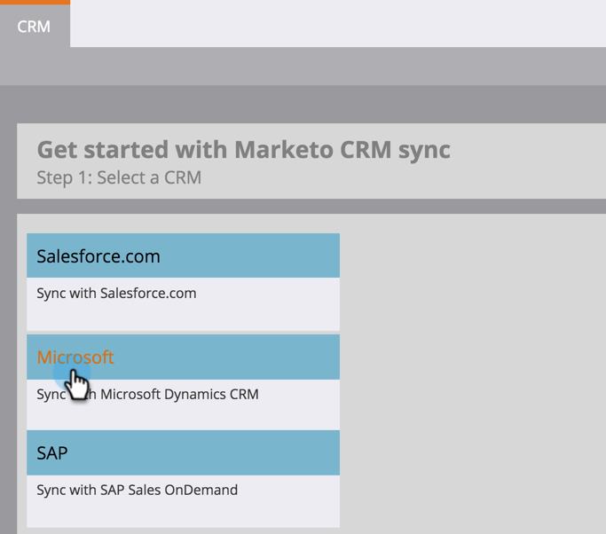

# Download da solução de gerenciamento de leads do Marketo {#download-the-marketo-lead-management-solution}

>[!NOTE]
>
>**Permissões de administrador são necessárias**

Será necessário baixar e instalar uma Solução da Marketo na conta [!DNL Microsoft Dynamics] para iniciar a sincronização.

>[!CAUTION]
>
>é fundamental baixar a Solução da Marketo mais recente _antes_ de executar qualquer atualização.

>[!NOTE]
>
>No momento, o Marketo só oferece suporte a certificados SSL compatíveis com o Java 7.

1. Vá para a área **[!UICONTROL Administrador]**.

   

1. Clique em **[!UICONTROL CRM]**.

   

1. Selecione **[!DNL Microsoft]**.

   

1. Selecione **[!UICONTROL Baixar Solução da Marketo]**.

   

1. Selecione a solução apropriada para sua versão [!DNL Microsoft Dynamics].

   

Fantástico! Um arquivo zip da solução agora será baixado para o dispositivo.
