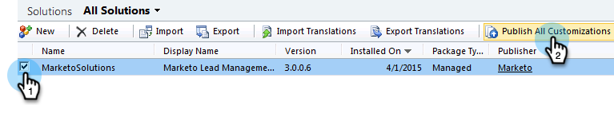

# Etapa 1 de 3: Instale a solução Marketo (2011 On-Premise) {#step-of-install-the-marketo-solution-on-premises}

Antes de poder sincronizar o Microsoft Dynamics On-Premise e o Marketing, é necessário instalar primeiro a solução Marketo no Dynamics.

>[!NOTE]
>
>Depois de sincronizar o Marketo com um CRM, não é possível executar uma nova sincronização sem substituir a instância.

>[!PREREQUISITES]
>
>Você deve ter [Implantação para Internet](https://www.microsoft.com/en-us/download/confirmation.aspx?id=41701) (IFD) com [Serviços de Federação do Ative Diretory](https://msdn.microsoft.com/en-us/library/bb897402.aspx) 2.0, 2.1 ou 3.0 (ADFS) configurados. **Observação**: O documento IFD é baixado automaticamente quando você clica no link.
>
>[Baixe a ](/help/marketo/product-docs/crm-sync/microsoft-dynamics-sync/sync-setup/download-the-marketo-lead-management-solution.md) solução de gerenciamento líder de marketing antes do start.

>[!NOTE]
>
>**Permissões do administrador dinâmico necessárias.**
>
>Você precisa de privilégios de administrador do CRM para executar essa sincronização.

1. Faça logon em **Dinâmicas**, selecione **Configurações** no menu inferior esquerdo.

   

1. Selecione **Soluções** na árvore.

   

1. Clique em **Importar**.

   

1. Clique em **Procurar**. Selecione a solução de Gerenciamento líder de marketing [baixada](/help/marketo/product-docs/crm-sync/microsoft-dynamics-sync/sync-setup/download-the-marketo-lead-management-solution.md). Clique em **Próximo**.

   

1. Visualização as Informações da solução e clique em **Detalhes do pacote da solução de Visualização**.

   

1. Quando terminar de verificar todos os detalhes, clique em **Fechar**.

   

1. Na página Informações da solução, clique em **Próximo**.

   

1. Verifique se a caixa de seleção da opção de mensagem do SDK está marcada. Clique em **Próximo**.

   

   >[!TIP]
   >
   >Será necessário ativar pop-ups no seu navegador para concluir o processo de instalação.

1. Agora espere a importação terminar. Levante-se e faça alguns trechos.

   

1. Clique em **Fechar**.

   >[!NOTE]
   >
   >Você pode ver uma mensagem dizendo &quot;Gerenciamento de cliente potencial concluído com aviso&quot;. Isso é totalmente esperado.

   

1. O Gerenciamento líder de marketing agora será exibido na página **Todas as soluções**.

   

1. Selecione Gerenciamento de cliente em potencial e clique em **Publicar todas as personalizações.**

   

Não era tão ruim, certo? Vamos, eu continuarei te guiando pelo resto.

>[!CAUTION]
>
>A desativação de qualquer um dos processos de mensagens do SDK do Marketo resultará em uma instalação interrompida!

>[!MORELIKETHIS]
>
>[Etapa 2 de 3: Configurar usuário de sincronização de marketing no Dynamics (2011 no local)](/help/marketo/product-docs/crm-sync/microsoft-dynamics-sync/sync-setup/microsoft-dynamics-2011-on-premises/step-2-of-3-set-up.md)
