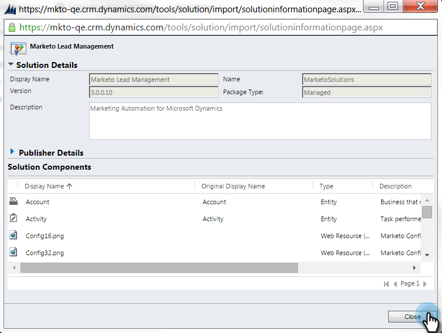

# Etapa 1 de 3: Configurar usuário de sincronização para o Marketo (2015 On-Prem e 2016 365 On-Prem) {#step-of-configure-sync-user-for-marketo-on-premises-and-365}

Antes de poder sincronizar o Microsoft Dynamics 2015 On-Premise ou 2016 (Dynamics 365) com o Marketo, é necessário instalar primeiro a solução Marketo no Dynamics.

>[!NOTE]
>
>Depois de sincronizar o Marketo com um CRM, não é possível sincronizar um novo CRM com a instância atual do Marketo.

>[!PREREQUISITES]
>
>Se estiver usando o Microsoft Dynamics On-Premise, você deverá ter [Implantação do Internet Facing](https://www.microsoft.com/en-us/download/confirmation.aspx?id=41701) (IFD) com [Serviços de Federação do Ative Diretory](https://msdn.microsoft.com/en-us/library/bb897402.aspx) 2.0+ (ADFS) configurado. Observação: O documento IFD é baixado automaticamente quando você clica no link.
>
>[Baixe a ](/help/marketo/product-docs/crm-sync/microsoft-dynamics-sync/sync-setup/download-the-marketo-lead-management-solution.md) solução de gerenciamento líder de marketing antes do start.

>[!NOTE]
>
>**Permissões do administrador dinâmico necessárias.**
>
>Você precisa de privilégios de administrador do CRM para executar essa sincronização.

1. Faça logon em **Dinâmicas.** Clique no menu suspenso  **do Microsoft Dynamics** CRM e selecione  **Configurações**.

   

1. Em **Configurações**, selecione **Soluções**.

   

1. Clique em **Importar**.

   

1. Clique em **Procurar** e selecione a solução que [baixou](/help/marketo/product-docs/crm-sync/microsoft-dynamics-sync/sync-setup/download-the-marketo-lead-management-solution.md). Clique em **Próximo**.

   

1. Visualização as Informações da solução e clique em **Detalhes do pacote da solução de Visualização**.

   

1. Quando terminar de verificar todos os detalhes, clique em **Fechar**.

   

1. Na página Informações da solução, clique em **Próximo**.

   

1. Verifique se a caixa de seleção da opção SDK está selecionada. Clique em **Importar**.

   

1. Aguarde a importação terminar.

   >[!TIP]
   >
   >Será necessário ativar pop-ups no seu navegador para concluir o processo de instalação.

   

1. Baixe um arquivo de log (se desejar) e clique em **Fechar**.

   >[!NOTE]
   >
   >Você pode ver uma mensagem dizendo &quot;Gerenciamento de cliente potencial concluído com aviso&quot;. Isso é totalmente esperado.

   

1. O Gerenciamento líder de marketing agora será exibido na página **Todas as soluções**.

   

1. Selecione a solução Marketo e clique em **Publicar todas as personalizações**.

   

   Alto cinco! A instalação foi concluída.

   >[!CAUTION]
   >
   >A desativação de qualquer um dos processos de mensagens do SDK do Marketo resultará em uma instalação interrompida!

   >[!MORELIKETHIS]
   >
   >[Instale o Marketo para o Dynamics 2015 On-Prem e 2016 365 On-Prem Etapa 2 de 3](/help/marketo/product-docs/crm-sync/microsoft-dynamics-sync/sync-setup/microsoft-dynamics-2015-on-premises-2016-dynamics-365-on-premises/step-2-of-3-set-up.md)
