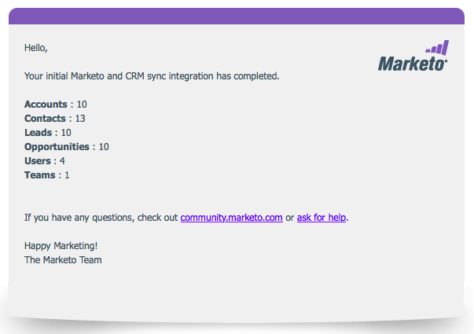

# Etapa 3 de 3: Conectar Marketo [!DNL Dynamics] (2016 No Local/[!DNL Dynamics] 365 No Local) {#step-of-connect-marketo-dynamics-on-premises-2016}

>[!PREREQUISITES]
>
>* [Instalar Marketo para [!DNL Microsoft Dynamics] 2016/[!DNL Dynamics] 365 No Local Etapa 1 de 3](/help/marketo/product-docs/crm-sync/microsoft-dynamics-sync/sync-setup/microsoft-dynamics-2016-dynamics-365-on-premises/step-1-of-3-install.md)
>* [Instalar Marketo para [!DNL Microsoft Dynamics] 2016/[!DNL Dynamics] 365 No Local Etapa 2 de 3](/help/marketo/product-docs/crm-sync/microsoft-dynamics-sync/sync-setup/microsoft-dynamics-2016-dynamics-365-on-premises/step-2-of-3-set-up.md)

>[!NOTE]
>
>**Permissões de administrador necessárias**

## Inserir informações do Usuário de Sincronização [!DNL Dynamics] {#enter-dynamics-sync-user-information}

1. Faça logon no Marketo e clique em **[!UICONTROL Admin]**.

   

1. Clique em **[!UICONTROL CRM]**.

   

1. Selecione **[!DNL Microsoft]**.

   

1. Clique em **[!UICONTROL Editar]** em **Etapa 1: Inserir credenciais**.

   

   >[!CAUTION]
   >
   >Verifique se suas credenciais estão corretas, pois não é possível reverter as alterações subsequentes no esquema após o envio. Se credenciais incorretas forem salvas, será necessário obter uma nova assinatura do Marketo.

1. Insira o **Nome de Usuário**, **Senha**, [!DNL Microsoft Dynamics] **URL** e um **Segredo/ID do Cliente**. Clique em **Salvar** quando terminar.

   

   >[!NOTE]
   >
   >* Se seu Marketo foi provisionado antes de outubro de 2020, ID do cliente e Segredo são campos opcionais. Caso contrário, elas são obrigatórias. A obtenção dessas informações dependerá da versão do MSD que você estiver usando.
   >* O Nome de Usuário no Marketo deve corresponder ao Nome de Usuário para o usuário de sincronização no CRM. O formato pode ser `user@domain.com` ou DOMÍNIO\usuário.
   >* Se você não souber a URL, [saiba como encontrá-la aqui](/help/marketo/product-docs/crm-sync/microsoft-dynamics-sync/sync-setup/view-the-organization-service-url.md){target="_blank"}.

   >[!TIP]
   >
   >Não sabe o URL? Mostraremos como encontrar sua [[!DNL Dynamics] URL do Serviço de Organização](/help/marketo/product-docs/crm-sync/microsoft-dynamics-sync/sync-setup/view-the-organization-service-url.md) aqui.

## Selecionar campos para a sincronização {#select-fields-to-sync}

1. Clique em **[!UICONTROL Editar]** em **[!UICONTROL Etapa 2: Selecionar campos a serem sincronizados]**.

   

1. Selecione os campos que deseja sincronizar com o Marketo para que sejam pré-selecionados. Clique em **[!UICONTROL Salvar]**.

   

>[!NOTE]
>
>O Marketo armazena uma referência aos campos a serem sincronizados. Se você excluir um campo em [!DNL Dynamics], recomendamos fazê-lo com a [sincronização desabilitada](/help/marketo/product-docs/crm-sync/salesforce-sync/enable-disable-the-salesforce-sync.md). Em seguida, atualize o esquema no Marketo editando e salvando os [Selecionar campos para sincronização](/help/marketo/product-docs/crm-sync/microsoft-dynamics-sync/microsoft-dynamics-sync-details/microsoft-dynamics-sync-field-sync/editing-fields-to-sync-before-deleting-them-in-dynamics.md).

## Sincronizar campos para um filtro personalizado {#sync-fields-for-a-custom-filter}

Se você criou um filtro personalizado, selecione os novos campos que serão sincronizados com o Marketo.

1. Acesse Administrador e selecione **[!DNL Microsoft Dynamics]**.

   

1. Clique em **[!UICONTROL Editar]** em Detalhes da Sincronização de Campo.

   

1. Role para baixo até o campo e marque-o. O nome real deve ser new_synctomkto, mas o Nome de exibição pode ser qualquer item. Clique em **[!UICONTROL Salvar]**.

   

## Ativar sincronização {#enable-sync}

1. Clique em **[!UICONTROL Editar]** em **[!UICONTROL Etapa 3: Habilitar Sincronização]**.

   

   >[!CAUTION]
   >
   >O Marketo não irá desduplicar automaticamente em relação a uma sincronização [!DNL Microsoft Dynamics] ou quando você inserir pessoas manualmente.

1. Leia tudo na janela pop-up, insira seu email e clique em **[!UICONTROL Iniciar sincronização]**.

   

1. Dependendo do número de registros, a sincronização inicial pode levar de algumas horas a alguns dias. Você receberá uma notificação por e-mail após a conclusão.

   
