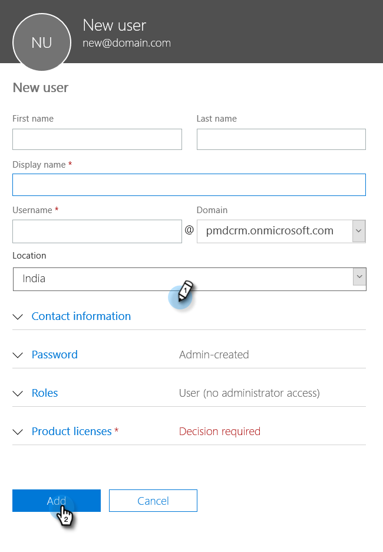

# Etapa 2 de 4: Configurar a Solução da Marketo com a Conexão de Controle de Senha do Proprietário do Recurso {#step-2-of-4-set-up-the-marketo-solution-ropc}

Vamos começar criando uma conta de usuário.

>[!PREREQUISITES]
>
>[Etapa 1 de 4: Instalar a Solução da Marketo com a Conexão de Controle de Senha do Proprietário do Recurso](/help/marketo/product-docs/crm-sync/microsoft-dynamics-sync/sync-setup/microsoft-dynamics-365-with-ropc-connection/step-1-of-4-install.md){target="_blank"}

## Criar um novo usuário {#create-a-new-user}

1. Faça logon em [!DNL Dynamics]. Clique no ícone [!UICONTROL Configurações] e selecione **[!UICONTROL Configurações Avançadas]**.

   

1. Clique em **[!UICONTROL Configurações]** e selecione **[!UICONTROL Segurança]**.

   

1. Clique em **[!UICONTROL Usuários]**.

   

1. Clique em **[!UICONTROL Novo]**.

   

1. Clique em **[!UICONTROL Adicionar e licenciar usuários]** na nova janela.

   

1. Uma nova guia é aberta. Clique em **[!UICONTROL Administrador]** na parte superior da página.

   

1. Outra nova guia é aberta. Clique em **[!UICONTROL Adicionar um usuário]**.

   

   >[!IMPORTANT]
   >
   >O usuário de sincronização deve ter permissão de leitura para a configuração do Marketo.

1. Insira todas as suas informações. Quando terminar, clique em **[!UICONTROL Adicionar]**.

   

   >[!NOTE]
   >
   >Esse nome deve ser um usuário de sincronização dedicado e não uma conta existente de usuário do CRM. Não precisa ser um endereço de email real.

1. Insira o email para receber as novas credenciais de usuário e clique em **[!UICONTROL Enviar email e fechar]**.

   

## Atribuir Função de Usuário de Sincronização {#assign-sync-user-role}

Atribua a função de Usuário de sincronização do Marketo somente ao usuário de sincronização do Marketo. Você não precisa atribuí-lo a nenhum outro usuário.

>[!NOTE]
>
>Isso se aplica à versão 4.0.0.14 e posterior do Marketo. Para versões anteriores, todos os usuários devem ter a função de usuário sincronizar. Para atualizar o Marketo, consulte [Atualizar Solução Marketo para [!DNL Microsoft Dynamics]](/help/marketo/product-docs/crm-sync/microsoft-dynamics-sync/sync-setup/update-the-marketo-solution-for-microsoft-dynamics.md).

>[!IMPORTANT]
>
>A configuração de idioma do Usuário de Sincronização [ deve ser definida como Inglês](https://learn.microsoft.com/en-us/power-platform/admin/enable-languages){target="_blank"}.

1. Volte para a guia [!UICONTROL Usuários Habilitados] e atualize a lista de usuários.

   

1. Passe o mouse ao lado do usuário recém-criado do Marketo Sync e uma caixa de seleção será exibida. Clique para selecioná-la.

   

1. Clique em **[!UICONTROL Gerenciar Funções]**.

   

1. Marque **[!UICONTROL Usuário da Sincronização do Marketo]** e clique em **[!UICONTROL OK]**.

   

   >[!NOTE]
   >
   >Quaisquer atualizações feitas em seu CRM pelo Usuário da Sincronização _não_ serão sincronizadas com o Marketo novamente.

## Configurar a solução da Marketo {#configure-marketo-solution}

Quase lá! Tudo o que resta é informar a solução Marketo sobre o novo usuário criado.

1. Volte para a seção [!UICONTROL Configurações Avançadas], clique no ícone  ao lado de [!UICONTROL Configurações] e selecione **[!UICONTROL Configuração do Marketo]**.

   

   >[!NOTE]
   >
   >Se você não vir a **[!UICONTROL Configuração do Marketo]** no menu [!UICONTROL Configurações], atualize a página. Se isso não funcionar, tente [publicar a Solução da Marketo](/help/marketo/product-docs/crm-sync/microsoft-dynamics-sync/sync-setup/microsoft-dynamics-365-with-ropc-connection/step-1-of-4-install.md) novamente ou sair e entrar novamente.

1. Clique em **[!UICONTROL Padrão]**.

   

1. Clique no botão de pesquisa no campo **[!UICONTROL Usuário do Marketo]** e selecione o usuário de sincronização criado.

   

1. Clique no ícone  no canto inferior direito para salvar as alterações.

   

1. Clique no **X** no canto superior direito para fechar a tela.

   

1. Clique no ícone  ao lado de [!UICONTROL Configurações] e selecione **[!UICONTROL Soluções]**.

   

1. Clique no botão **[!UICONTROL Publicar todas as personalizações]**.

   

>[!MORELIKETHIS]
>
>[Etapa 3 de 4: Conectar a Solução da Marketo com a Conexão de Controle de Senha do Proprietário do Recurso](/help/marketo/product-docs/crm-sync/microsoft-dynamics-sync/sync-setup/microsoft-dynamics-365-with-ropc-connection/step-3-of-4-set-up.md){target="_blank"}
