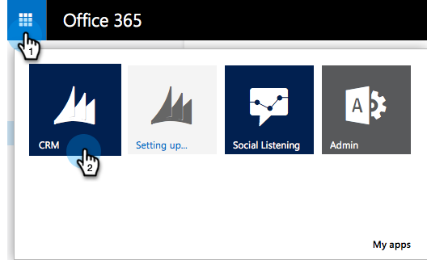

# Etapa 1 de 3: Instalar a solução da Marketo com conexão de servidor a servidor {#step-1-of-3-install-the-marketo-solution-s2s}

Antes de sincronizar o [!DNL Microsoft Dynamics 365] e o Marketo, é necessário instalar a solução da Marketo no [!DNL Dynamics]. **[!DNL Dynamics]Permissões de Administrador são necessárias.**

>[!CAUTION]
>
>Não habilite a sincronização de entidade personalizada antes que a sincronização inicial seja concluída. Você será notificado por email quando a sincronização inicial for concluída.

>[!NOTE]
>
>Após sincronizar o Marketo com um CRM, não é possível executar uma nova sincronização sem substituir a instância.

>[!PREREQUISITES]
>
>[Baixar a Solução Marketo de Gerenciamento de Clientes Potenciais](/help/marketo/product-docs/crm-sync/microsoft-dynamics-sync/sync-setup/download-the-marketo-lead-management-solution.md){target="_blank"}

1. Faça logon em **[[!DNL Microsoft Office 365]](https://login.microsoftonline.com/)**.

   

1. Clique no menu  e selecione **[!UICONTROL CRM]**.

   

1. Clique no menu . No menu suspenso, selecione **[!UICONTROL Configurações]** e selecione **[!UICONTROL Soluções]**.

   

1. Clique em **[!UICONTROL Importar]**.

   

1. Clique em **[!UICONTROL Escolher arquivo]**. Selecione a solução de gerenciamento de clientes potenciais da Marketo que você [baixou](/help/marketo/product-docs/crm-sync/microsoft-dynamics-sync/sync-setup/download-the-marketo-lead-management-solution.md). Clique em **[!UICONTROL Avançar]**.

   

1. Exiba as Informações da Solução e clique em **[!UICONTROL Exibir detalhes do pacote da solução]**.

   

1. Quando terminar de verificar todos os detalhes, clique em **[!UICONTROL Fechar]**.

   

1. Agora, de volta à página [!UICONTROL Informações da solução], clique em **[!UICONTROL Avançar]**.

   

1. Verifique se a caixa de seleção da opção SDK está marcada. Clique em **[!UICONTROL Importar]**.

   

   >[!TIP]
   >
   >Você precisará ativar os pop-ups no seu navegador para concluir o processo de instalação.

1. Agora aguarde a conclusão da importação.

   

1. Clique em **[!UICONTROL Fechar]**.

   >[!NOTE]
   >
   >Você pode ver uma mensagem dizendo &quot;O Gerenciamento de clientes potenciais da Marketo foi concluído com aviso&quot;. Isso é totalmente esperado.

   

1. O [!UICONTROL Gerenciamento de Clientes Potenciais da Marketo] será exibido na lista de soluções.

   

1. Selecione **[!UICONTROL Marketo Lead Management]** e clique em **[!UICONTROL Publicar todas as personalizações]**.

   

   Toque cinco! A instalação foi concluída.

   >[!MORELIKETHIS]
   >
   >[Etapa 2 de 3: Configurar a Solução da Marketo com Conexão S2S](/help/marketo/product-docs/crm-sync/microsoft-dynamics-sync/sync-setup/microsoft-dynamics-365-with-s2s-connection/step-2-of-3-set-up.md){target="_blank"}
