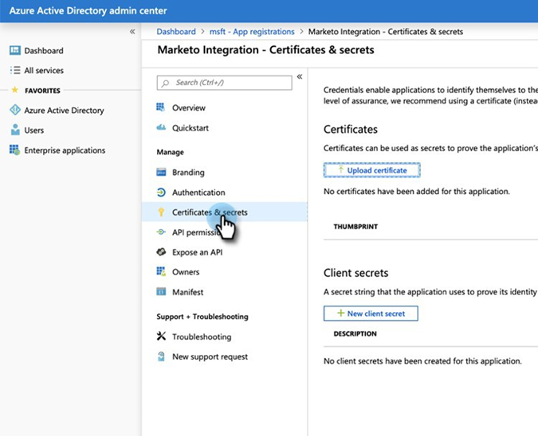

# Step 2 of 3: Set up Marketo Solution with Server to Server Connection {#step-2-of-3-set-up-marketo-sync-user-in-dynamics-s2s}

>[!PREREQUISITES]
>
>[Etapa 1 de 3: Instalar a solução Marketo com conexão de servidor para servidor](/help/marketo/product-docs/crm-sync/microsoft-dynamics-sync/sync-setup/microsoft-dynamics-365-with-s2s-connection/step-1-of-3-install.md)

## Criar aplicativo cliente no Azure AD {#create-client-application-in-azure-ad}

1. Navegar para [este artigo do Microsoft](https://docs.microsoft.com/en-us/powerapps/developer/common-data-service/walkthrough-register-app-azure-active-directory#create-an-application-registration).

1. Siga todas as etapas. Para a Etapa 3, insira um nome de aplicativo relevante (por exemplo, &quot;Integração do Marketo&quot;). Em Tipos de conta compatíveis, selecione **Conta somente neste Diretório Organizacional**.

1. Anote a ID do aplicativo (ClientId) e a ID do locatário. Você precisará inseri-lo no Marketo posteriormente.

1. Conceder consentimento ao administrador seguindo as etapas [neste artigo](/help/marketo/product-docs/crm-sync/microsoft-dynamics-sync/sync-setup/grant-consent-for-client-id-and-app-registration.md).

1. Gere um segredo do cliente no Admin Center clicando em **Certificados e segredos**.

   

1. Clique no botão **Novo segredo de cliente** botão.

   

1. Insira uma descrição secreta do cliente e clique em **Adicionar**.

   

>[!CAUTION]
>
>Certifique-se de anotar o valor Segredo do cliente (visto na captura de tela abaixo), pois ele será necessário posteriormente. Ela só é exibida uma vez e você não poderá recuperá-la novamente.

## Criar usuário do aplicativo no Microsoft {#create-application-user-in-microsoft}

1. Siga as etapas do link a seguir para [configurar um usuário do aplicativo no Microsoft](https://docs.microsoft.com/en-us/powerapps/developer/common-data-service/use-single-tenant-server-server-authentication#application-user-creation).

   >[!IMPORTANT]
   >
   >* While giving permissions to the Application User, be sure to assign it to &quot;Marketo Sync User Role.&quot;
   >* Note the email address of the Application User from the [view details option](https://docs.microsoft.com/en-us/power-platform/admin/manage-application-users#view-or-edit-the-details-of-an-application-user) on Power Platform. Esse endereço de email será usado como nome de usuário ao configurar a conexão com o MS Dynamics no Marketo.

## Azure AD Federated com AD FS no local {#azure-ad-federated-with-ad-fs-on-prem}

Federated Azure AD to ADFS Onprem needs the creation of a Home Realm Discovery policy for the specific application. Com esta política, o Azure AD redirecionará a solicitação de autenticação para o serviço de federação. Password hash synchronization has to be enabled in AD Connect for this. Para obter mais informações, consulte [OAuth com ROPC](https://docs.microsoft.com/en-us/azure/active-directory/develop/v2-oauth-ropc) e [Definir uma política de hardware para um aplicativo](https://docs.microsoft.com/en-us/azure/active-directory/manage-apps/configure-authentication-for-federated-users-portal#example-set-an-hrd-policy-for-an-application).

Referências adicionais [pode ser encontrada aqui](https://docs.microsoft.com/en-us/azure/active-directory/reports-monitoring/concept-all-sign-ins#:~:text=Interactive%20user%20sign%2Dins%20are,as%20the%20Microsoft%20Authenticator%20app.&amp;text=Este%20report%20also%20inclui%20federado, são%20federado%20a%20Azure%20AD.).

## Configurar a solução Marketo {#configure-marketo-solution}

Quase lá! Resta informar a Marketo Solution sobre o novo usuário criado.

>[!IMPORTANT]
>
>Se estiver atualizando da Autenticação Básica para o OAuth, será necessário entrar em contato com o [Suporte Marketo](https://nation.marketo.com/t5/support/ct-p/Support) para obter ajuda com a atualização dos parâmetros adicionais. A execução de uma alteração de configuração para o usuário de Sincronização padrão interromperá temporariamente a sincronização até que novas credenciais sejam inseridas e a sincronização seja reativada. A seu pedido, o Suporte da Marketo pode desativar o recurso (até abril de 2022), caso deseje reverter para o método de autenticação antigo.

1. Volte para a seção Configurações avançadas e clique no botão  ícone ao lado de Configurações e selecione **Configuração do Marketo**.

   

   >[!NOTE]
   >
   >Se você não vir **Configuração do Marketo** no menu Configurações , atualize a página. Se isso não funcionar, tente [publicar a solução Marketo](/help/marketo/product-docs/crm-sync/microsoft-dynamics-sync/sync-setup/microsoft-dynamics-365-with-s2s-connection/step-1-of-3-install.md) novamente ou faça logoff e volte.

1. Clique em **Padrão**.

   

1. Clique no botão de pesquisa na **Usuário do Marketo** e selecione o usuário de sincronização que você criou.

   

1. Clique no botão  no canto inferior direito para salvar as alterações.

   

1. Clique no botão **X** no canto superior direito para fechar a tela.

   

1. Clique no botão  ícone ao lado de Configurações e selecione **Soluções**.

   

1. Clique no botão **Publicar todas as personalizações** botão.

   

## Before Proceeding to Step 3 {#before-proceeding-to-step}

* Se quiser restringir o número de registros sincronizados, [configurar um filtro de sincronização personalizado](/help/marketo/product-docs/crm-sync/microsoft-dynamics-sync/create-a-custom-dynamics-sync-filter.md) agora.
* Run the [Validate Microsoft Dynamics Sync](/help/marketo/product-docs/crm-sync/microsoft-dynamics-sync/sync-setup/validate-microsoft-dynamics-sync.md) process. It verifies that your initial setups were done correctly.
* Faça logon no usuário do Marketo Sync no Microsoft Dynamics CRM.

>[!MORELIKETHIS]
>
>* [Etapa 3 de 3: Conecte a solução Marketo com a conexão de servidor ao servidor](/help/marketo/product-docs/crm-sync/microsoft-dynamics-sync/sync-setup/microsoft-dynamics-365-with-s2s-connection/step-3-of-3-connect.md)
>* [Reconfigure o método de autenticação do Dynamics](/help/marketo/product-docs/crm-sync/microsoft-dynamics-sync/sync-setup/reconfigure-dynamics-authentication-method.md)

