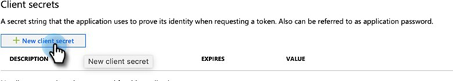

# Etapa 2 de 3: Configurar a solução da Marketo com conexão de servidor a servidor {#step-2-of-3-set-up-marketo-sync-user-in-dynamics-s2s}

>[!PREREQUISITES]
>
>[Etapa 1 de 3: Instalar a Solução da Marketo com Conexão Servidor a Servidor](/help/marketo/product-docs/crm-sync/microsoft-dynamics-sync/sync-setup/microsoft-dynamics-365-with-s2s-connection/step-1-of-3-install.md){target="_blank"}

## Criar Aplicativo Cliente em [!DNL Azure AD] {#create-client-application-in-azure-ad}

1. Navegue até [este artigo do Microsoft](https://docs.microsoft.com/en-us/powerapps/developer/common-data-service/walkthrough-register-app-azure-active-directory#create-an-application-registration){target="_blank"}.

1. Siga todas as etapas. Para a Etapa 3, insira um nome de aplicativo relevante (por exemplo, &quot;[!DNL Marketo Integration]&quot;). Em Tipos de Conta com Suporte, selecione **Conta Somente neste Diretório Organizacional**.

1. Anote a ID do aplicativo (ClientId) e a ID do locatário. Você precisará inseri-lo no Marketo mais tarde.

1. Conceda o consentimento do Administrador seguindo as etapas [neste artigo](/help/marketo/product-docs/crm-sync/microsoft-dynamics-sync/sync-setup/grant-consent-for-client-id-and-app-registration.md){target="_blank"}.

1. Gere um Segredo do cliente no Admin Center clicando em **[!UICONTROL Certificados e segredos]**.

   

1. Clique no botão **[!UICONTROL Novo segredo do cliente]**.

   

1. Insira uma descrição secreta do cliente e clique em **[!UICONTROL Adicionar]**.

   

>[!CAUTION]
>
>Anote o valor do Segredo do cliente (visto na captura de tela abaixo), como você precisará dele posteriormente. É exibido apenas uma vez e não será possível recuperá-lo novamente.

## Criar usuário do aplicativo no Microsoft {#create-application-user-in-microsoft}

1. Siga as etapas do link a seguir para [configurar um usuário de aplicativo no Microsoft](https://docs.microsoft.com/en-us/powerapps/developer/common-data-service/use-single-tenant-server-server-authentication#application-user-creation){target="_blank"}.

   >[!IMPORTANT]
   >
   >* Ao conceder permissões ao usuário do aplicativo, atribua-o à &quot;Função de usuário da sincronização do Marketo&quot;.
   >* Anote o endereço de email do Usuário do Aplicativo na [opção exibir detalhes](https://docs.microsoft.com/en-us/power-platform/admin/manage-application-users#view-or-edit-the-details-of-an-application-user) da Power Platform. Esse endereço de email será usado como nome de usuário ao configurar a conexão com o MS [!DNL Dynamics] no Marketo.

## [!DNL Azure AD] Federado com [!DNL AD FS On-prem] {#azure-ad-federated-with-ad-fs-on-prem}

A federação de [!DNL Azure AD] a [!DNL ADFS Onprem] precisa da criação de uma política de Descoberta de Domínio Doméstico para o aplicativo específico. Com esta política, [!DNL Azure AD] redirecionará a solicitação de autenticação para o serviço de federação. A sincronização de hash de senha deve ser habilitada em [!DNL AD Connect] para isso. Para obter mais informações, consulte [[!DNL OAuth] com [!DNL ROPC]](https://docs.microsoft.com/en-us/azure/active-directory/develop/v2-oauth-ropc) e [Definir uma política de hardware para um aplicativo](https://docs.microsoft.com/en-us/azure/active-directory/manage-apps/configure-authentication-for-federated-users-portal#example-set-an-hrd-policy-for-an-application).

Referências adicionais [podem ser encontradas aqui](https://docs.microsoft.com/en-us/azure/active-directory/reports-monitoring/concept-all-sign-ins#:~:text=Interactive%20user%20sign%2Dins%20are,as%20the%20Microsoft%20Authenticator%20app.&text=This%20report%20also%20includes%20federated, are%20federated%20to%20Azure%20AD.){target="_blank"}.

## Configurar a solução da Marketo {#configure-marketo-solution}

Quase lá! Tudo o que resta é informar a solução Marketo sobre o novo usuário criado.

1. Volte para a seção [!UICONTROL Configurações Avançadas], clique no ícone  ao lado de [!UICONTROL Configurações] e selecione **[!UICONTROL Configuração do Marketo]**.

   

   >[!NOTE]
   >
   >Se você não vir &quot;Configuração do Marketo&quot; no menu Configurações, atualize a página. Se isso não funcionar, tente [publicar a Solução da Marketo](/help/marketo/product-docs/crm-sync/microsoft-dynamics-sync/sync-setup/microsoft-dynamics-365-with-s2s-connection/step-1-of-3-install.md){target="_blank"} novamente ou sair e entrar novamente.

1. Clique em **[!UICONTROL Padrão]**.

   

1. Clique no botão de pesquisa no campo **[!UICONTROL Usuário do Marketo]** e selecione o usuário de sincronização criado.

   

1. Clique no ícone  no canto inferior direito para salvar as alterações.

   

1. Clique no **X** no canto superior direito para fechar a tela.

   

1. Clique no ícone  ao lado de [!UICONTROL Configurações] e selecione **[!UICONTROL Soluções]**.

   

1. Clique no botão **[!UICONTROL Publicar todas as personalizações]**.

   

   >[!NOTE]
   >
   >Se estiver atualizando da Autenticação Básica para o [!DNL OAuth], você pode usar o [este artigo](/help/marketo/product-docs/crm-sync/microsoft-dynamics-sync/sync-setup/reconfigure-dynamics-authentication-method.md) para reconfigurar sua autenticação.

## Antes de prosseguir para a Etapa 3 {#before-proceeding-to-step}

* Se quiser restringir o número de registros sincronizados, [configure um filtro de sincronização personalizado](/help/marketo/product-docs/crm-sync/microsoft-dynamics-sync/create-a-custom-dynamics-sync-filter.md) agora.
* Execute o processo [Validate [!DNL Microsoft Dynamics] Sync](/help/marketo/product-docs/crm-sync/microsoft-dynamics-sync/sync-setup/validate-microsoft-dynamics-sync.md). Ele verifica se as configurações iniciais foram feitas corretamente.
* Faça logon no Usuário de Sincronização do Marketo no [!DNL Microsoft Dynamics] CRM.

>[!MORELIKETHIS]
>
>* [Etapa 3 de 3: Conectar a Solução da Marketo com Conexão Servidor a Servidor](/help/marketo/product-docs/crm-sync/microsoft-dynamics-sync/sync-setup/microsoft-dynamics-365-with-s2s-connection/step-3-of-3-connect.md)
>* [Reconfigurar [!DNL Dynamics] Método de Autenticação](/help/marketo/product-docs/crm-sync/microsoft-dynamics-sync/sync-setup/reconfigure-dynamics-authentication-method.md)
