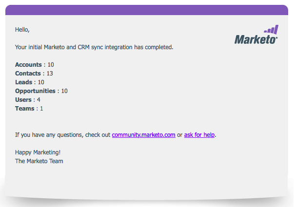

# Etapa 3 de 3: Conectar a solução da Marketo com conexão de servidor a servidor {#step-3-of-3-connect-microsoft-dynamics-with-marketo-solution-s2s}

Esta é a última etapa da sincronização. Estamos quase lá!

>[!PREREQUISITES]
>
>* [Etapa 1 de 3: Instalar a solução da Marketo com conexão de servidor a servidor](/help/marketo/product-docs/crm-sync/microsoft-dynamics-sync/sync-setup/microsoft-dynamics-365-with-s2s-connection/step-1-of-3-install.md){target="_blank"}
>* [Etapa 2 de 3: Configurar a solução da Marketo com conexão de servidor a servidor](/help/marketo/product-docs/crm-sync/microsoft-dynamics-sync/sync-setup/microsoft-dynamics-365-with-s2s-connection/step-2-of-3-set-up.md){target="_blank"}

>[!NOTE]
>
>**Permissões de administrador necessárias**

>[!IMPORTANT]
>
>Se estiver atualizando da Autenticação básica para o OAuth, você precisará entrar em contato com [Suporte ao Marketo](https://nation.marketo.com/t5/support/ct-p/Support){target="_blank"} para obter ajuda com a atualização dos parâmetros adicionais. Habilitar este recurso interromperá temporariamente a sincronização até que novas credenciais sejam inseridas e a sincronização seja reabilitada. O recurso pode ser desativado (até abril de 2022) se você quiser reverter para o modo de autenticação antigo.

>[!NOTE]
>
>Antes de inserir novas credenciais, você pode [valide-os aqui](/help/marketo/product-docs/crm-sync/microsoft-dynamics-sync/sync-setup/validate-microsoft-dynamics-sync.md){target="_blank"}.

## Inserir informações do Usuário da Sincronização Dinâmica {#enter-dynamics-sync-user-information}

1. Faça logon no Marketo e clique em **[!UICONTROL Admin]**.

   

1. Clique em **[!UICONTROL CRM]**.

   

1. Selecionar **[!DNL Microsoft]**.

   

1. Clique em **[!UICONTROL Editar]** in **[!UICONTROL Inserir credenciais]**.

   

   >[!CAUTION]
   >
   >Verifique se o URL da organização está correto, pois não é possível reverter as alterações subsequentes no esquema após o envio. Se um URL de organização incorreto for usado, será necessário obter uma nova assinatura do Marketo. Se você não souber o URL, [saiba como encontrá-lo aqui](/help/marketo/product-docs/crm-sync/microsoft-dynamics-sync/sync-setup/view-the-organization-service-url.md){target="_blank"}.

1. Insira as informações do usuário da sincronização dinâmica e clique em **[!UICONTROL Salvar]** quando terminar.

   

   >[!NOTE]
   >
   >O nome de usuário no Marketo deve corresponder ao [endereço de email](https://docs.microsoft.com/en-us/power-platform/admin/manage-application-users#view-or-edit-the-details-of-an-application-user){target="_blank"} do usuário do aplicativo no CRM. O formato pode ser `user@domain.com` ou DOMAIN\user.

## Selecionar campos para a sincronização {#select-fields-to-sync}

1. Clique em **[!UICONTROL Editar]** in **[!UICONTROL Selecionar campos para sincronização]**.

   

1. Selecione os campos que deseja sincronizar com o Marketo para que sejam pré-selecionados. Clique em **[!UICONTROL Salvar]**.

   

>[!NOTE]
>
>O Marketo armazena uma referência aos campos a serem sincronizados. Se você excluir um campo no Dynamics, recomendamos fazer isso com o [sincronização desabilitada](/help/marketo/product-docs/crm-sync/salesforce-sync/enable-disable-the-salesforce-sync.md){target="_blank"}. Then refresh the schema in Marketo by editing and saving the [Select Fields to Sync](/help/marketo/product-docs/crm-sync/microsoft-dynamics-sync/microsoft-dynamics-sync-details/microsoft-dynamics-sync-field-sync/editing-fields-to-sync-before-deleting-them-in-dynamics.md){target="_blank"}.

## Sincronizar campos para um filtro personalizado {#sync-fields-for-a-custom-filter}

Se você criou um filtro personalizado, selecione os novos campos que serão sincronizados com o Marketo.

1. Acesse Administrador e selecione **[!DNL Microsoft Dynamics]**.

   

1. Clique em **[!UICONTROL Editar]** em Detalhes da sincronização de campo.

   

1. Role para baixo até o campo e marque-o. O nome real deve ser new_synctomkto, mas o Nome de exibição pode ser qualquer item. Clique em **[!UICONTROL Salvar]**.

   

## Ativar sincronização {#enable-sync}

1. Clique em **[!UICONTROL Editar]** in **[!UICONTROL Habilitar sincronização]**.

   

   >[!CAUTION]
   >
   >A Marketo não eliminará automaticamente a duplicação em relação a uma sincronização do Microsoft Dynamics ou quando você inserir pessoas ou leads manualmente.

1. Leia tudo na janela pop-up, digite seu endereço de email e clique em **[!UICONTROL Iniciar sincronização]**.

   

1. A primeira sincronização pode levar algumas horas. Depois de concluído, você receberá uma notificação por email.

   

Excelente trabalho!
