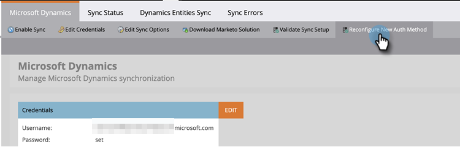

# Reconfigurar Método de Autenticação do Dynamics {#reconfigure-dynamics-authentication-method}

Siga as etapas abaixo para atualizar seu Método de Autenticação do Dynamics.

>[!PREREQUISITES]
>
>Configure o aplicativo no Microsoft Dynamics e no Ative Diretory (Azure AD/ADFS) usando o método de autenticação desejado em um dos seguintes artigos:
>
>* [Etapa 2 de 3: Configurar a solução da Marketo com conexão de servidor a servidor](/help/marketo/product-docs/crm-sync/microsoft-dynamics-sync/sync-setup/microsoft-dynamics-365-with-s2s-connection/step-2-of-3-set-up.md){target="_blank"}
>* [Etapa 2 de 4: Configurar a Solução da Marketo com a Conexão de Controle de Senha do Proprietário do Recurso](/help/marketo/product-docs/crm-sync/microsoft-dynamics-sync/sync-setup/microsoft-dynamics-365-with-ropc-connection/step-2-of-4-set-up.md){target="_blank"}

1. No Marketo Engage, clique em **[!UICONTROL Admin]**.

   

1. Clique em **[!DNL Microsoft Dynamics]**, depois **[!UICONTROL Desativar sincronização]**.

   

   >[!NOTE]
   >
   >Você deve desativar a sincronização global temporariamente para atualizar o Método de autenticação.

1. Clique em **[!UICONTROL Reconfigurar novo método de autenticação]** guia.

   

1. Selecione o novo Método de autenticação desejado (neste exemplo, estamos escolhendo a API da Web).

   

1. Insira as credenciais necessárias para o novo Método de autenticação e clique em **[!UICONTROL Validar]**.

   

   >[!NOTE]
   >
   >* Os campos específicos variam de acordo com o método de autenticação escolhido e o formulário será atualizado automaticamente, dependendo do método de autenticação anterior.
   >* Se você já tiver sincronizado antes, os dados no formulário acima podem estar pré-preenchidos. Insira novamente todas as credenciais para garantir os valores corretos.

1. Se tudo estiver bem, a opção Validar sincronização gerará todas as marcas de seleção verdes . Revise a mensagem e clique em **[!UICONTROL Alternar]** para atualizar o Método de autenticação.

   

   >[!NOTE]
   >
   >Se você vir um , essa etapa tem um problema. Consulte [Corrigir Problemas de Sincronização de Validação do Dynamics](/help/marketo/product-docs/crm-sync/microsoft-dynamics-sync/sync-setup/validate-microsoft-dynamics-sync/fix-dynamics-validation-sync-issues.md){target="_blank"} para identificar e corrigir o(s) problema(s). Em seguida, execute novamente as etapas de validação de sincronização até que o resultado se pareça com a imagem acima.

1. Clique em **[!UICONTROL Confirmar o]** para continuar.

   

1. Clique em **[!UICONTROL Confirmar o]** novamente.

   

1. Clique em **[!UICONTROL OK]**.

   >[!IMPORTANT]
   >
   >O sistema leva 15 minutos para aceitar o novo modo de autenticação. Aguarde 15 minutos a partir da hora do comutador antes de reativar a sincronização.
