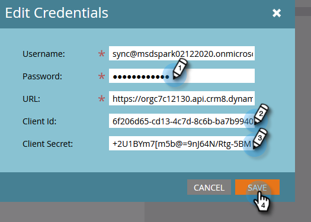

# Configurar o aplicativo Microsoft Dynamics CRM para {#set-up-microsoft-dynamics-crm-app-for-online} online

## Configurar o Aplicativo do Microsoft Dynamics CRM para Online{#set-up-microsoft-dynamics-crm-app-for-online}

1. Navegue até https://docs.microsoft.com/en-us/powerapps/developer/common-data-service/walkthrough-register-app-azure-active-directory#create-an-application-registration.

1. Siga todas as etapas. Para a Etapa 3, insira um nome de aplicativo relevante (por exemplo, &quot;Integração do Marketo&quot;). Em Tipos de conta suportados, selecione Conta somente neste diretório organizacional.

1. Anote a ID do aplicativo (ClientId). Você precisará inseri-lo mais tarde no Marketo.

1. Conceda consentimento do administrador seguindo as etapas em [este artigo](/help/marketo/product-docs/crm-sync/microsoft-dynamics-sync/sync-setup/set-up-oauth-authentication-for-dynamics/grant-consent-for-client-id-and-app-registration.md).

1. Gere um Segredo do Cliente no Admin Center clicando em **Certificados e segredos**.

   

1. Clique em **Novo segredo de cliente**.

   

1. Adicione uma descrição Segredo do cliente e clique em **Adicionar**.

   

   >[!CAUTION]
   >
   >Certifique-se de anotar o valor Segredo do cliente (visto na captura de tela abaixo), pois ele será necessário posteriormente. Ela só é exibida uma vez e você não poderá recuperá-la novamente.

   

O Marketo é autenticado no Azure AD com OAuth usando grant_type Resource Owner Password Credentials (ROPC). Esse cenário precisa da criação de uma política de Descoberta de Domínio para o aplicativo específico. Com esta política, o Azure AD redirecionará a solicitação de autenticação para o serviço de federação. Para isso, a sincronização de hash de senha deve ser ativada no AD Connect. Para obter mais informações, consulte [OAuth com ROPC](https://docs.microsoft.com/en-us/azure/active-directory/develop/v2-oauth-ropc) e [Definir uma política rígida para um aplicativo](https://docs.microsoft.com/en-us/azure/active-directory/manage-apps/configure-authentication-for-federated-users-portal#example-set-an-hrd-policy-for-an-application).

Referências adicionais [podem ser encontradas aqui](https://docs.microsoft.com/en-us/azure/active-directory/reports-monitoring/concept-all-sign-ins#:~:text=Interactive%20user%20sign%2Dins%20are,as%20the%20Microsoft%20Authenticator%20app.&amp;text=Este%20report%20also%20inclui%20federado, são%20federado%20a%20Azure%20AD.).

Quando terminar, é hora de **Inserir a ID de cliente gerada pelo Dynamics CRM e o segredo no Marketo**.

## Insira a ID do cliente gerada pelo Dynamics CRM e o segredo no Marketo {#enter-the-dynamics-crm-generated-client-id-and-secret-into-marketo}

As etapas a seguir são aplicáveis às versões online _e_ no local.

1. No Marketo, clique em **Admin**.

   

1. Clique em **Microsoft Dynamics**.

   

1. Clique em **Desativar Sincronização**.

   

1. Ao lado de credenciais, clique em **Editar**.

   

1. Insira o **Client Id** e o **Client Secret** que você recuperou anteriormente e pressione **Save**.

   

1. Clique em **Validar Configuração de Sincronização**.

   

1. Clique em **Next**.

   

1. Você deve ver todas as marcas de seleção verdes. Clique em **Fechar**.

   

   >[!NOTE]
   >
   >Se você vir um X vermelho entre suas marcas de seleção verdes, consulte [este artigo](/help/marketo/product-docs/crm-sync/microsoft-dynamics-sync/sync-setup/validate-microsoft-dynamics-sync/fix-dynamics-validation-sync-issues.md) para obter as opções de correção.

1. Clique em **Ativar Sincronização**.

   

E é isso!
