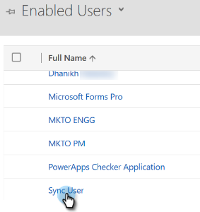

# Corrigir problemas de sincronização de validação do Dynamics {#fix-dynamics-validation-sync-issues}

## Validar resultados da ferramenta de sincronização {#validate-sync-tool-results}

Quando você executa a Sincronização do Dynamics Validate, ela gera este relatório. Se houver uma  ao lado de uma etapa, consulte abaixo para identificar e corrigir o problema. Em seguida, execute novamente as etapas de validação de sincronização até que o resultado não mostre nada além de marcas de seleção.

## O URL é válido {#url-is-valid}

Se você tiver uma  aqui, verifique se o URL é válido. Encontre-o aqui nos Recursos do desenvolvedor e veja o Serviço da organização. O URL pode ser inválido por vários motivos.

1. Faça logon no Dynamics. Clique no ícone Configurações e selecione Configurações **** avançadas.

   

1. Clique em Configurações e selecione **Personalizações**.

   

1. Clique em Recursos **do** desenvolvedor.

   

1. O URL do Serviço da Organização pode ser encontrado em Pontos de Extremidade do Serviço.

   

## O nome de usuário e a senha são válidos {#username-and-password-are-valid}

Se você tiver um nome  aqui, verifique se seu nome de usuário e senha do Microsoft Dynamics são válidos.

## O usuário de sincronização é atribuído à função de usuário de sincronização de marketing {#sync-user-is-assigned-to-the-marketo-sync-user-role}

Se você tiver um  aqui, verifique se a função Usuário de sincronização de marketing está marcada no Microsoft Dynamics. Consulte a Etapa 2 da documentação de instalação do MIcrosoft Dynamics.

1. Em Dinâmicas, clique no ícone Configurações e selecione Configurações **** avançadas.

   

1. Clique em **Configurações** e selecione **Segurança**.

   

1. Clique em **Usuários.**

   

1. Clique no link do usuário de sincronização.

   

1. Clique em **Gerenciar funções**.

   

1. Verifique se a função Usuário de sincronização de marketing está marcada. Caso contrário, marque-o e clique em **OK.**

   

## A solução Marketo está instalada corretamente {#marketo-solution-is-properly-installed}

Se você tiver um  aqui, vá para o Microsoft Dynamics para verificar se a instalação do Marketo está lá. Consulte a Etapa 1 da documentação de configuração do Microsoft Dynamics.

1. Em Dinâmicas, clique no ícone Configurações e selecione Configurações **** avançadas.

   

1. Clique em **Configurações **e selecione **Soluções.**

   

1. Verifique se a solução está listada.

   

## Todas as etapas da solução estão ativadas {#all-steps-in-the-solution-are-enabled}

Se você tiver um  aqui, verifique se nenhuma das etapas padrão foi desativada. Todas as etapas são ativadas automaticamente na instalação, mas podem ser desativadas durante uma personalização.

## O usuário de sincronização é atribuído à solução Marketo {#sync-user-is-assigned-to-the-marketo-solution}

Se você tiver um  aqui, verifique se o usuário de sincronização está atribuído na página Padrão de marketing no Microsoft Dynamics.

1. Em Dinâmicas, clique no ícone Configurações e selecione Configurações **** avançadas.

   

1. Clique em **Configurações **e selecione Configuração **de marketing**.

   

1. Verifique se o usuário de sincronização está atribuído como padrão.

   

## O usuário de sincronização corresponde ao nome de usuário e à senha {#sync-user-matches-username-and-password}

Se você tiver um  aqui, certifique-se de atribuir o usuário de sincronização apropriado no campo Usuário do Marketo na etapa de configuração Padrão de configuração do Marketo no Microsoft Dynamics.

>[!NOTE]
>
>**Artigos relacionados**
>
>[Validar Microsoft Dynamics Sync](../../../../../product-docs/crm-sync/microsoft-dynamics-sync/sync-setup/validate-microsoft-dynamics-sync.md)

