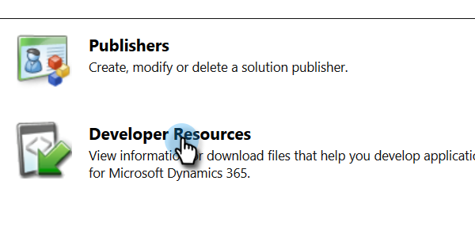

# Exibir o URL de serviço da organização {#view-the-organization-service-url}

O Marketo Engage precisa do URL do Serviço da Organização para sincronizar com instâncias MD. Veja como encontrá-lo no Dynamics.

1. Faça logon em [!DNL Dynamics]. Clique no ícone Configurações e selecione **[!UICONTROL Configurações avançadas]**.

   

1. Clique em **[!UICONTROL Configurações]** e selecione **[!UICONTROL Personalizações]**.

   

1. Clique em **[!UICONTROL Recursos do desenvolvedor]**.

   

1. A URL do Serviço de Organização pode ser encontrada em **[!UICONTROL Pontos de Extremidade de Serviço]**.

   

1. Copie e cole esse URL no Marketo e aproveite o resto da sincronização.
