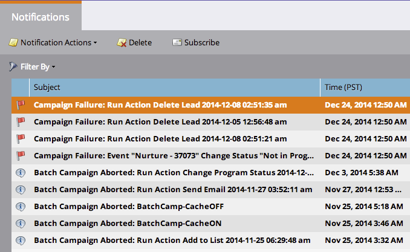

# Adicionar/remover valores da lista de seleção {#add-remove-picklist-values}

Veja algumas informações a serem feitas sobre a adição e remoção de valores da lista de opções em [!DNL Salesforce].

## Adição De Valores De Lista De Opções {#adding-picklist-values}

1. Se um valor adicional for adicionado no Salesforce a um tipo de campo de lista de opções, você receberá uma [notificação](/help/marketo/product-docs/core-marketo-concepts/miscellaneous/understanding-notifications.md){target="_blank"} identificando quais formulários serão afetados.

   

1. Vá para o editor de formulários e [adicione o valor adicional](/help/marketo/product-docs/demand-generation/forms/form-actions/add-a-country-picklist-to-your-form.md){target="_blank"} à lista de sugestões.

## Remover Valores da Lista de Seleção {#remove-picklist-values}

Quando um valor de lista de opções é removido de um campo em [!DNL Salesforce], é necessário remover manualmente esse valor de todos os formulários que hospedam esse campo.

>[!NOTE]
>
>Se um campo de cliente potencial e um campo de contato no Salesforce tiverem valores diferentes, os valores em comum estarão disponíveis para uso no Marketo Engage.

Se um campo de cliente potencial e um campo de contato em [!DNL Salesforce] tiverem valores diferentes:

1. Adicionar um valor adicional no SFDC a uma lista de opções receberá uma notificação.
1. A notificação informará onde ela é usada. Agora você pode adicionar esse novo valor como uma opção no formulário, se desejar.

Se uma lista de opções de um cliente potencial do SFDC tiver valores diferentes de uma lista de opções de um contato do SFDC, os valores comuns serão usados como opções de valor padrão no formulário.

Se você remover um valor de uma lista de opções, terá que removê-lo manualmente como uma opção de seus formulários.
