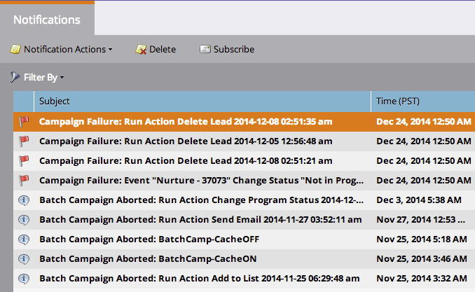

# Adicionar/remover valores da lista de opções {#add-remove-picklist-values}

Estas são algumas informações sobre adicionar e remover valores da lista de opções no Salesforce.

## Adicionar valores da lista de opções {#adding-picklist-values}

1. Se um valor adicional for adicionado no Salesforce a um tipo de campo de lista de seleção, você receberá uma [notificação](/help/marketo/product-docs/core-marketo-concepts/miscellaneous/understanding-notifications.md) identificando quais formulários isso afetará.

   

1. Vá para o editor de formulário e [adicione o valor adicional](/help/marketo/product-docs/demand-generation/forms/form-actions/add-a-country-picklist-to-your-form.md) à lista de sugestões.

## Remover valores da lista de opções {#remove-picklist-values}

Quando um valor de lista de seleção é removido de um campo no Salesforce, é necessário remover manualmente esse valor de todos os formulários que hospedam esse campo.

>[!NOTE]
>
>Se um campo de lead e um campo de contato no Salesforce tiverem valores diferentes, os valores em comum estarão disponíveis para uso no Marketo.

Se um campo de lead e um campo de contato no Salesforce tiverem valores diferentes:

1. Adicionar um valor adicional no SFDC a uma lista de opções receberá uma notificação.
1. A notificação informará onde é usada. Agora é possível adicionar esse novo valor como uma opção no formulário, se desejar.

Se uma lista de opções de um lead SFDC tiver valores diferentes de uma lista de opções para um contato SFDC, os valores comuns serão usados como opções de valor padrão no formulário.

Se você remover um valor de uma lista de opções, será necessário removê-lo manualmente como uma opção de seus formulários.
