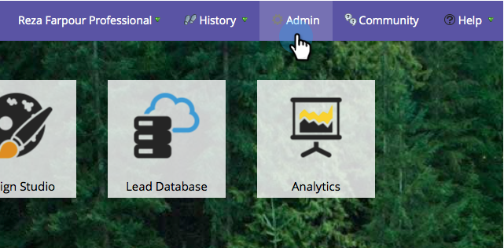

# Habilitar/Desabilitar a Sincronização do [!DNL Salesforce] {#enable-disable-the-salesforce-sync}

Ao fazer grandes alterações nas configurações de sincronização ou campo, você deve desativar a sincronização enquanto configura o. Veja como:

1. Vá para a seção **[!UICONTROL Admin]**.

   

1. Em **[!UICONTROL Salesforce]**, clique em **[!UICONTROL Desabilitar Sincronização]**.

   

1. A sincronização bidirecional agora estará desativada e inativa até que você a reative. [!DNL Salesforce] ações de fluxo continuarão a funcionar.

   

1. Faça as alterações e habilite a sincronização novamente. É o mesmo botão.
