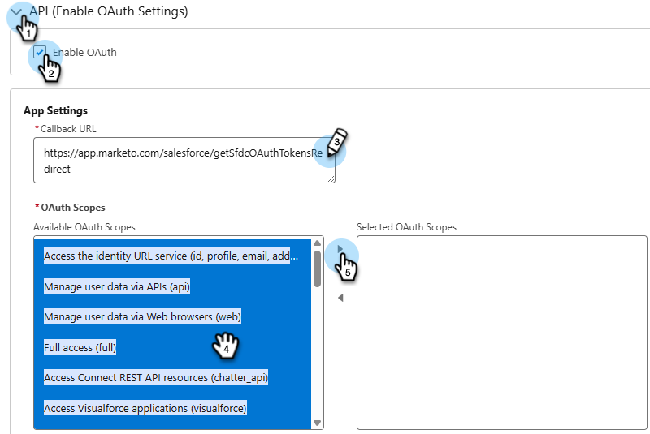
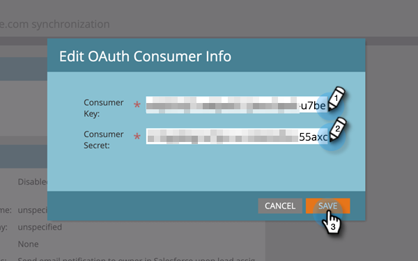

# Fazer logon usando OAuth 2.0 {#log-in-using-oauth-2-0}

O Salesforce usa o protocolo OAuth para permitir que os usuários de aplicativos acessem com segurança (autentique o aplicativo usando o OAuth 2.0) os dados sem precisar revelar credenciais de logon. Abaixo estão as etapas a serem executadas para conectar e sincronizar com segurança o Marketo Engage com o Salesforce.

>[!IMPORTANT]
>
>Para conectar o Marketo e o [!DNL Salesforce] usando OAuth, faça logon no Marketo via navegador privado (incógnito) para evitar a conexão com [!DNL Salesforce] com o nome de usuário errado.

## Configurar Aplicativo Cliente Externo {#set-up-external-client-app}

>[!NOTE]
>
>A partir de setembro de 2025, o Salesforce começou a restringir o uso de [Aplicativos conectados](https://help.salesforce.com/s/articleView?id=005132365&type=1){target="_blank"}. Para usuários existentes que configuraram um Aplicativo conectado com base em nossa documentação, você pode adicionar a permissão &quot;Aprovar aplicativos conectados desinstalados&quot; ao perfil do usuário do Marketo Sync ou criar um novo Aplicativo cliente externo usando as instruções abaixo.

1. No Salesforce, clique no ícone de engrenagem e selecione **Instalação**.

   

1. Na caixa Localização Rápida, digite `App Manager` e selecione **Gerenciador de Aplicativos**.

   

1. Clique em **Novo Aplicativo Cliente Externo**.

   

1. Preencha os detalhes em _Informações Básicas_. Definir _Estado de Distribuição_ como **Local**.

   

1. Expanda a seção **API (Ativar configurações do OAuth)** e marque a caixa de seleção **[!UICONTROL Ativar OAuth]**. Para a _URL de Retorno_, digite `https://app.marketo.com/salesforce/getSfdcOAuthTokensRedirect`. Selecione todos os Escopos OAuth disponíveis e clique na seta para a direita para adicioná-los.

   

1. Em _Habilitação de fluxo_, verifique se nenhuma caixa está selecionada.

   

1. Em _Segurança_, verifique se apenas **Exigir segredo para Fluxo do Servidor Web** e **Exigir segredo para Fluxo do Token de Atualização** estão selecionados.

   

1. Ignore as quatro últimas seções e clique em **Criar**.

   

1. Depois que o novo Aplicativo de Cliente Externo for criado, selecione a guia **Configurações** e expanda a seção **Configurações OAuth**.

   

1. Clique no botão **Chave e segredo do consumidor**, solicitando que uma nova guia seja aberta. Copie e salve os dois números (será necessário usá-los posteriormente no Marketo Engage).

   

## Configurar o Marketo {#set-up-marketo}

>[!PREREQUISITES]
>
>* O acesso à API deve ser ativado para o usuário do Salesforce Sync (se você for um usuário do Salesforce Professional Edition, esse acesso não estará disponível por padrão. Entre em contato com o executivo da conta da Salesforce).
>* O usuário do Marketo Sync deve ser criado no Salesforce.
>* Para clientes existentes, o recurso para &quot;Habilitar OAuth para sincronização do SFDC&quot; está habilitado na assinatura do cliente.
>* Os bloqueadores de pop-ups estão desativados.
>* O Aplicativo Conectado foi criado e temos a [!UICONTROL Chave do Consumidor] e o [!UICONTROL Segredo do Consumidor] disponíveis para uso.

>[!CAUTION]
>
>Oculte todos os campos desnecessários no Marketo do usuário de sincronização antes de clicar em **[!UICONTROL Sincronizar campos]**. Depois de clicar em Sincronizar campos, todos os campos que o usuário puder ver no SFDC serão criados no Marketo permanentemente e não poderão ser excluídos.

1. Na seção Administrador do Marketo, clique em **[!UICONTROL CRM]** e em **[!UICONTROL Sincronizar com o Salesforce]**.

   

1. Adicione as informações da Chave do consumidor e do Segredo do consumidor gravadas anteriormente e clique em e **[!UICONTROL Salvar]**.

   

1. Na página de sincronização do Marketo Salesforce, clique no botão **[!UICONTROL Fazer logon com o Salesforce]**.

   

   >[!CAUTION]
   >
   >Se você estiver vendo os campos Nome de usuário/Senha/Token e não um botão &quot;Logon com o Salesforce&quot;, sua Assinatura do Marketo será habilitada para a Autenticação básica. Consulte [Configurar o Marketo com Autenticação Básica](/help/marketo/product-docs/crm-sync/salesforce-sync/setup/enterprise-unlimited-edition/step-3-of-3-connect-marketo-and-salesforce-enterprise-unlimited.md){target="_blank"}. Quando a sincronização começar a usar um conjunto de credenciais, não haverá alternância de credenciais ou assinatura da Salesforce. Para configurar o Oauth 2.0 para sua autenticação da Salesforce, contate o [Suporte da Marketo](https://nation.marketo.com/t5/support/ct-p/Support){target="_blank"}.

1. Um pop-up com a página de logon do salesforce será exibido. Insira suas credenciais de &quot;Usuário da sincronização do Marketo&quot; e faça logon.

   

1. Insira o código de verificação recebido por email (enviado pela Salesforce) e clique em **[!UICONTROL Verificar]**.

   

1. Após a verificação bem-sucedida, a página de acesso será exibida solicitando acesso. Clique em **[!UICONTROL Permitir]**.

   

1. Em alguns minutos, uma janela pop-up será exibida no Marketo. Clique em **[!UICONTROL Confirmar Credenciais]**.

   

1. Após a conclusão da Sincronização de Campo, clique em **[!UICONTROL Iniciar Sincronização do Salesforce]**.

   

1. Clique em **[!UICONTROL Iniciar sincronização]**.

   

A sincronização entre o Marketo e o [!DNL Salesforce] está em andamento.

>[!MORELIKETHIS]
>
>* [Etapa 1 de 3: Adicionar Campos do Marketo à Salesforce (Enterprise/Unlimited)](/help/marketo/product-docs/crm-sync/salesforce-sync/setup/enterprise-unlimited-edition/step-1-of-3-add-marketo-fields-to-salesforce-enterprise-unlimited.md){target="_blank"}
>* [Etapa 2 de 3: Criar um Usuário do Salesforce para Marketo (Enterprise/Unlimited)](/help/marketo/product-docs/crm-sync/salesforce-sync/setup/enterprise-unlimited-edition/step-2-of-3-create-a-salesforce-user-for-marketo-enterprise-unlimited.md){target="_blank"}
>* [Instalar o pacote Marketo Sales Insight no Salesforce AppExchange](/help/marketo/product-docs/marketo-sales-insight/msi-for-salesforce/installation/install-marketo-sales-insight-package-in-salesforce-appexchange.md){target="_blank"}
>* [Configurar o Marketo Sales Insight no Salesforce Enterprise/Unlimited](/help/marketo/product-docs/marketo-sales-insight/msi-for-salesforce/configuration/configure-marketo-sales-insight-in-salesforce-enterprise-unlimited.md){target="_blank"}
