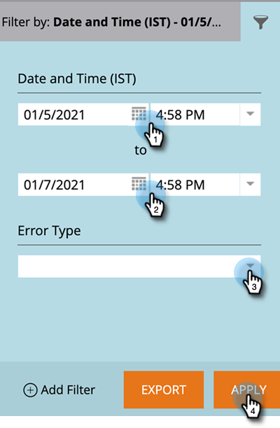

# [!DNL Salesforce] Erros de sincronização {#salesforce-sync-errors}

Visualize um resumo dos erros encontrados durante o processo de sincronização. Isso inclui erros causados por falhas na sincronização de dados incompatíveis.

>[!NOTE]
>
>**Permissões de administrador são necessárias**

## Exibir Erros de Sincronização {#view-sync-errors}

1. Clique em **[!UICONTROL Administrador]**.

   

1. Em Integração, clique em **Salesforce** e, em seguida, na guia **[!UICONTROL Erros de Sincronização]**.

   

>[!NOTE]
>
>Os erros listados variam da hora atual até cinco dias antes da sincronização atual.

| Campo | Descrição |
|---|---|
| Falha em | Nível de Registro _ou_ Nível de Trabalho |
| Data/hora da falha | Detalhes do erro |
| Tipo de erro | Mensagem de retorno do SFDC |

>[!TIP]
>
>Clicar no registro de nível de registro mostra a Marketo e as [!DNL Salesforce] IDs do objeto relacionado. Em alguns casos, a mensagem no registro e os erros de nível de trabalho são diretamente de [!DNL Salesforce]. A pesquisa on-line pode fornecer detalhes adicionais.

## Filtrar erros de sincronização {#filter-sync-errors}

1. Para filtrar os dados, clique no ícone de filtro na extremidade direita da página.

   

1. Selecione o intervalo de data e hora e filtre por Tipo de erro (Nível da tarefa ou Nível de registro). Clique em **[!UICONTROL Aplicar]** quando terminar.

   

**ETAPA OPCIONAL**: para exportar erros de sincronização, clique em **[!UICONTROL Exportar]**. Os dados serão exportados como um CSV.

