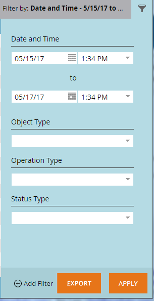

# Status da sincronização do Salesforce {#salesforce-sync-status}

Use o Painel de Status da Sincronização para exibir as estatísticas de sincronização como parte das etapas de sincronização e seu status de sucesso.

As etapas de Sincronização refletem as operações de push ou pull por cada tipo de objeto para o esquema de objeto e os próprios dados. As estatísticas abrangem novos registros, atualizações, exclusões e contagens de falhas durante a sincronização. Os usuários podem filtrar por data, tipo de operação ou tipo de objeto. Painel de Status da Sincronização mostra o status dos ciclos de sincronização dos últimos cinco dias.

>[!NOTE]
>
>Permissões de administrador necessárias

## Exibir Status de Sincronização {#view-sync-status}

1. Clique em **[!UICONTROL Administrador]**.

   

1. Em [!UICONTROL Integração], clique em **Salesforce**, depois na guia **[!UICONTROL Status de sincronização]**.

   

Por padrão, as estatísticas serão classificadas pela última vez em que foram iniciadas. Você pode classificar por Iniciado em ou Encerrado em (do mais recente para o mais antigo) clicando no ícone de classificação.

## Filtrar status de sincronização {#filter-sync-status}

1. Para filtrar os dados, clique no ícone de filtro na extremidade direita da página.

   

1. Selecione o intervalo de data e hora e clique no(s) menu(s) suspenso(s) para filtrar por [!UICONTROL Tipo de Objeto], [!UICONTROL Tipo de Operação] e/ou [!UICONTROL Tipo de Status].

   

1. Clique em **[!UICONTROL Aplicar]**.

   

**ETAPA OPCIONAL**: para exportar erros de sincronização, clique em **[!UICONTROL Exportar]**. Os dados serão exportados como um CSV.

## Campos de status de sincronização {#sync-status-fields}

<table> 
 <colgroup> 
  <col> 
  <col> 
  <col> 
 </colgroup> 
 <tbody> 
  <tr> 
   <th>Campo</th> 
   <th>Descrição</th> 
   <th>Valores de Enumeração</th> 
  </tr> 
  <tr> 
   <td colspan="1">Iniciado em</td> 
   <td colspan="1">A data/hora de início do ciclo de sincronização (fuso horário do usuário)</td> 
   <td colspan="1"></td> 
  </tr>  
  <tr> 
   <td colspan="1">Encerrado em</td> 
   <td colspan="1">A data/hora final do ciclo de sincronização (fuso horário do usuário)</td> 
   <td colspan="1"></td> 
  </tr> 
  <tr> 
   <td colspan="1">Objeto</td> 
   <td colspan="1">Tipo de objeto</td> 
   <td colspan="1">Contato, Pessoa, Tarefa, Oportunidade, Cliente Potencial, Outros conforme abaixo</td> 
  </tr>  
  <tr> 
   <td colspan="1">Operação</td> 
   <td colspan="1">Tipo de operação</td> 
   <td colspan="1">Tipos de operação conforme abaixo</td> 
  </tr>  
  <tr> 
   <td colspan="1">Status</td> 
   <td colspan="1">Status do lote</td> 
   <td colspan="1">Êxito, Falha, Incompleto, Em andamento, Limpo*</td> 
  </tr>
  <tr> 
   <td colspan="1">Novo</td> 
   <td colspan="1">Contagem de novos registros</td> 
   <td colspan="1"></td> 
  </tr>  
  <tr> 
   <td colspan="1">Atualizado</td> 
   <td colspan="1">Contagem de registros atualizados</td> 
   <td colspan="1"></td> 
  </tr>  
  <tr> 
   <td colspan="1">Excluído</td> 
   <td colspan="1">Contagem de registros excluídos</td> 
   <td colspan="1"></td> 
  </tr> 
  <tr> 
   <td colspan="1">Falha no item</td> 
   <td colspan="1">Número de registros cuja sincronização falhou</td> 
   <td colspan="1"> </td> 
  </tr>  
  <tr> 
   <td colspan="1">Ignorado</td> 
   <td colspan="1">Contagem de registros ignorados porque não houve alterações nos campos de interesse para a sincronização</td> 
   <td colspan="1"></td> 
  </tr>  
 </tbody> 
</table>

&#42;Dados revertidos para o estado anterior de integridade após falha da etapa de sincronização.

## Tipo de objeto {#object-type}

<table> 
 <colgroup> 
  <col> 
 </colgroup> 
 <tbody> 
  <tr> 
   <td colspan="1">Conta</td> 
  </tr>  
  <tr> 
   <td colspan="1">Tipo de conta</td> 
  </tr> 
  <tr> 
   <td colspan="1">Objetos personalizados</td> 
  </tr>  
  <tr> 
   <td colspan="1">Campanha</td> 
  </tr>  
  <tr> 
   <td colspan="1">Status de membro de campanha</td> 
  </tr>
  <tr> 
   <td colspan="1">Contato</td> 
  </tr>  
  <tr> 
   <td colspan="1">Modelo de e-mail</td> 
  </tr>  
  <tr> 
   <td colspan="1">Evento</td> 
  </tr> 
  <tr> 
   <td colspan="1">Pessoa (lead)</td> 
  </tr>  
  <tr> 
   <td colspan="1">Oportunidade</td> 
  </tr>  
  <tr> 
   <td colspan="1">Função de contato em oportunidades</td> 
  </tr>  
  <tr> 
   <td colspan="1">Tarefa</td> 
  </tr>  
  <tr> 
   <td colspan="1">Usuário</td> 
  </tr>  
 </tbody> 
</table>

## Tipo de operação {#operation-type}

<table> 
 <colgroup> 
  <col> 
  <col> 
  <col>
  <col> 
 </colgroup> 
 <tbody> 
  <tr> 
   <th>Tipo de operação</th> 
   <th>Encontrado nesses Objetos</th> 
   <th>Observações</th> 
   <th>Tipo de operação</th>
  </tr> 
  <tr> 
   <td colspan="1">Iniciar link com o programa</td> 
   <td colspan="1">Campanha</td> 
   <td colspan="1">Vinculando campanhas a programas</td> 
   <td colspan="1">Atualização</td>
  </tr>  
  <tr> 
   <td colspan="1">Extrair conversões</td> 
   <td colspan="1">Pessoa (lead)*</td> 
   <td colspan="1">Extrair ações de conversão do SFDC para o Marketo. Unidades (números) são clientes em potencial que convertem em Contatos</td> 
   <td colspan="1">Atualização, item com falha ou ignorado</td>
  </tr> 
  <tr> 
   <td colspan="1">Extrair exclusões</td> 
   <td colspan="1">Contato, Pessoa (Cliente Potencial), Oportunidade, Campanha, Membros Da Campanha, Contato Da Oportunidade, Objetos Personalizados, Campanhas, Status Do Membro Da Campanha, Função Do Contato Da Oportunidade</td> 
   <td colspan="1">Registros excluídos do SFDC que está sendo sincronizado com o Marketo</td> 
   <td colspan="1">Excluído, item com falha ou ignorado</td>
  </tr>  
  <tr> 
   <td colspan="1">Extrair atualizações</td> 
   <td colspan="1">Tarefa, Pessoa (Lead), Fila De Pessoa (Lead), Contato, Evento, Oportunidade, Conta, Tipo De Conta, Membros Da Campanha, Objetos Personalizados, Campanhas, Status De Membro Da Campanha, Eventos, Status De Pessoa, Oportunidade, Função De Contato Da Oportunidade</td> 
   <td colspan="1">Atualizações ou novos registros no SFDC sincronizados com o Marketo, obtenha eventos como atividades</td> 
   <td colspan="1">Novo, atualizado, item com falha ou ignorado</td>
  </tr>  
  <tr> 
   <td colspan="1">Enviar novo(a)s</td> 
   <td colspan="1">Tarefas, Modelos de email</td> 
   <td colspan="1">Tarefas por push (atividades)</td> 
   <td colspan="1"></td>
  </tr>
  <tr> 
   <td colspan="1">Enviar atualizações</td> 
   <td colspan="1">Tarefas, Modelos de email, Pessoa, Contato, Campanhas</td> 
   <td colspan="1">Envio de atualizações ao SFDC e também exclusões</td> 
   <td colspan="1">Atualização, item com falha ou ignorado</td>
  </tr>  
  <tr> 
   <td colspan="1">Sincronizar esquemas</td> 
   <td colspan="1">Membros da campanha, Objetos personalizados, Campanhas, Status do membro da campanha, Tarefas, Pessoa, Oportunidade, Função de contato da oportunidade, Usuários</td> 
   <td colspan="1">Sincroniza metadados para objetos diferentes, para decidir quais novos campos serão sincronizados no próximo ciclo</td> 
   <td colspan="1"></td>
  </tr>  
  <tr> 
   <td colspan="1">Sincronizar com programa</td> 
   <td colspan="1">Campanhas</td> 
   <td colspan="1">Sincroniza o programa Marketo com campanhas SFDC</td> 
   <td colspan="1">Novo, Atualizações, Falha ou Ignorado</td>
  </tr> 
  <tr> 
   <td colspan="1">Atualizar atividades</td> 
   <td colspan="1">Tarefas</td> 
   <td colspan="1">Extração de atividades do Salesforce</td> 
   <td colspan="1"></td>
  </tr>  
  <tr> 
   <td colspan="1">Atualizar FKS</td> 
   <td colspan="1">Todos</td> 
   <td colspan="1">Atualizar chave estrangeira de todos os objetos</td> 
   <td colspan="1">N/D</td>
  </tr>  
 </tbody> 
</table>

&#42;A configuração de identidade visual no nível de assinatura decide o rótulo - &quot;Líder&quot; ou &quot;Pessoa&quot; no relatório.
