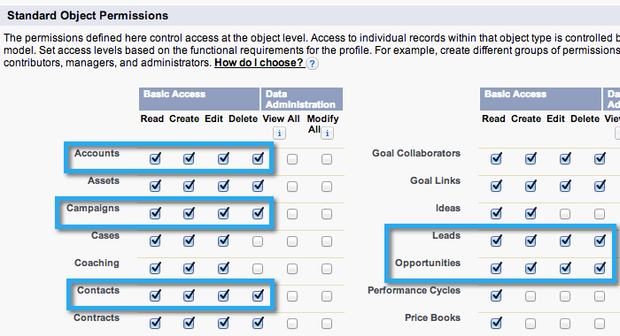

# Etapa 2 de 3: Criar um usuário do Salesforce para o Marketing (Enterprise/Unlimited) {#step-of-create-a-salesforce-user-for-marketo-enterprise-unlimited}

>[!NOTE]
>
>Essas etapas devem ser concluídas por um administrador do Salesforce

>[!PREREQUISITES]
>
>* [Etapa 1 de 3: Adicionar campos de marketing ao Salesforce (Enterprise/Unlimited)](step-1-of-3-add-marketo-fields-to-salesforce-enterprise-unlimited.md)

>

Neste artigo, você configurará permissões de usuário no perfil Salesforce e criará uma conta de integração do Marketing-Salesforce.

## Criar um Perfil {#create-a-profile}

1. Clique em **Configuração**.

   

1. Digite &quot;perfis&quot; na barra de pesquisa Navegador e clique no link **Perfis** .

   

1. Clique em **Novo**.

   

1. Selecione Usuário **** padrão, nomeie o perfil como &quot;Sincronização de Marketo-Salesforce&quot; e clique em **Salvar**.

   

## Definir permissões do Perfil {#set-profile-permissions}

1. Clique em **Editar** para definir as permissões de segurança.

   

1. Na seção Permissões **** administrativas, verifique se as seguintes caixas estão marcadas:

   * API ativada
   * Editar modelos HTML
   * Gerenciar Documentos públicos
   * Gerenciar modelos públicos

   

   >[!TIP]
   >
   >Certifique-se de marcar a caixa **Senha que nunca expira** .

1. Na seção Permissões gerais de usuário, verifique se as seguintes caixas estão marcadas:

   * Converter clientes em potencial
   * Editar Eventos
   * Editar Tarefas

   

1. Na seção Permissões de objeto padrão, verifique se as permissões de Leitura, Criação, Edição e Exclusão estão marcadas para:

   * Contas
   * Campanhas
   * Contatos
   * Clientes potenciais
   * Oportunidades

   >[!NOTE]
   >
   >Conceda permissões para as Campanhas, se planeja usar a Sincronização de Campanhas.

   

1. Quando terminar, clique em **Salvar** na parte inferior da página.

   

## Definir permissões de campo {#set-field-permissions}

1. Converse com seus comerciantes para descobrir quais campos personalizados são necessários para sincronizar.

   >[!NOTE]
   >
   >Esta etapa evitará que os campos que você não precisa sejam exibidos no Marketo, o que reduzirá a desorganização e agilizará a sincronização.

1. Na página de detalhes do perfil, vá para a seção Segurança **no nível do** campo. Clique em **Visualização** para editar a acessibilidade dos objetos:

   * `Lead`
   * `Contact`
   * `Account`
   * `Opportunity`

   >[!TIP]
   >
   >Você pode configurar outros objetos de acordo com as necessidades de sua organização.

   

1. Para cada objeto, clique em **Editar**.

   

1. Localize os campos desnecessários, verifique se **Acesso de leitura **e Acesso de edição **** estão desmarcados. Clique em **Salvar** quando terminar.

   >[!NOTE]
   >
   >**Lembrete**
   >
   >
   >Edite somente a acessibilidade para os campos personalizados.

   

1. Depois de desabilitar todos os campos desnecessários, você deve marcar **Acesso de leitura e Editar acesso **para os seguintes campos de objeto. Clique em **Salvar** quando terminar.

<table> 
 <tbody> 
  <tr> 
   <th colspan="1" rowspan="1">
Objeto
</th> 
   <th colspan="1" rowspan="1">
Campos
</th> 
  </tr> 
  <tr> 
   <td colspan="1" rowspan="1">
Conta
</td> 
   <td colspan="1" rowspan="1">
Campo Tipo
</td> 
  </tr> 
  <tr> 
   <td colspan="1" rowspan="1">
Evento
</td> 
   <td colspan="1" rowspan="1">
Todos os campos
</td> 
  </tr> 
  <tr> 
   <td colspan="1" rowspan="1">
Tarefa
</td> 
   <td colspan="1" rowspan="1">
Todos os campos
</td> 
  </tr> 
 </tbody> 
</table>

## Criar conta de sincronização do Marketing-Salesforce {#create-marketo-salesforce-sync-account}

>[!TIP]
>
>Criar uma conta exclusiva do Salesforce (por exemplo, [`[email protected]`](http://docs.marketo.com/cdn-cgi/l/email-protection#89e4e8fbe2ecfde6c9f0e6fcfbeae6e4f9e8e7f0a7eae6e4)) para diferenciar as alterações feitas pelo Marketo em relação a outros usuários do Salesforce.

1. Digite &quot;Gerenciar usuários&quot; na barra de pesquisa Navegador e clique em **Usuários**. Clique em **Novo usuário**.

   

1. Preencha os campos obrigatórios. Em seguida, selecione a Licença de **usuário: O Salesforce** e o Perfil criado anteriormente. Clique em **Salvar** quando terminar.

   

A etapa 2 de 2 é concluída.

>[!NOTE]
>
>**Artigos relacionados**
>
>* [Etapa 3 de 3: Connect Marketing e Salesforce (Enterprise/Unlimited)](step-3-of-3-connect-marketo-and-salesforce-enterprise-unlimited.md)

>

