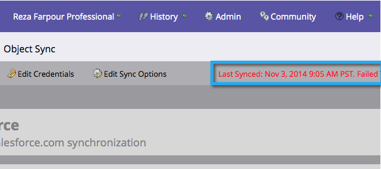

# Etapa 3 de 3: Conecte a Marketo e o Salesforce (Enterprise/Unlimited) {#step-of-connect-marketo-and-salesforce-enterprise-unlimited}

Neste artigo, você configurará o Marketo para sincronizar com a instância configurada do Salesforce.

>[!PREREQUISITES]
>
>* [Etapa 1 de 3: Adicionar campos do Marketo ao Salesforce (Enterprise/Unlimited)](/help/marketo/product-docs/crm-sync/salesforce-sync/setup/enterprise-unlimited-edition/step-1-of-3-add-marketo-fields-to-salesforce-enterprise-unlimited.md)
>* [Etapa 2 de 3: Criar um usuário do Salesforce para Marketo (Enterprise/Unlimited)](/help/marketo/product-docs/crm-sync/salesforce-sync/setup/enterprise-unlimited-edition/step-2-of-3-create-a-salesforce-user-for-marketo-enterprise-unlimited.md)

## Recuperar o token de segurança do usuário de sincronização {#retrieve-sync-user-security-token}

>[!TIP]
>
>Se você já tiver o token de segurança, continue diretamente para Definir as credenciais do usuário de sincronização e os kudos para preparação!

1. Faça logon no Salesforce com o usuário de sincronização da Marketo, clique no nome do usuário de sincronização e **Minhas configurações**.

   

1. Na localização rápida, digite &quot;redefinir&quot; e clique em **Redefinir meu token de segurança**.

   

1. Clique em **Redefinir Token de Segurança**.

   

   O token de segurança será enviado a você por email.

## Definir as Credenciais do Usuário de Sincronização {#set-sync-user-credentials}

1. No Marketo, acesse **Administrador**, selecione **CRM** e clique em **Sincronizar com [Salesforce.com](https://Salesforce.com)**

   

   >[!NOTE]
   >
   >Certifique-se de [ocultar todos os campos que não são necessários](/help/marketo/product-docs/crm-sync/salesforce-sync/sfdc-sync-details/hide-a-salesforce-field-from-the-marketo-sync.md) no Marketo a partir do usuário de sincronização antes de clicar **Sincronizar campos**. Depois de clicar em Sincronizar campos, todos os campos que o usuário pode ver serão criados no Marketo permanentemente e não poderão ser excluídos.

1. Insira as credenciais do usuário de sincronização do Salesforce criadas na parte 2 da configuração do Salesforce ([Profissional](/help/marketo/product-docs/crm-sync/salesforce-sync/setup/professional-edition/step-2-of-3-create-a-salesforce-user-for-marketo-professional.md) ou [Empresa](/help/marketo/product-docs/crm-sync/salesforce-sync/setup/enterprise-unlimited-edition/step-2-of-3-create-a-salesforce-user-for-marketo-enterprise-unlimited.md)) e clique em **Sincronizar campos** (verificar **Sandbox** somente se estiver sincronizando uma sandbox da Marketo com uma sandbox do Salesforce).

   

   >[!CAUTION]
   >
   >Se você vir um botão &quot;Fazer logon no Salesforce&quot; em vez dos campos Nome de usuário/Senha/Token, sua assinatura do Marketo será ativada para OAuth. Por favor [consulte este artigo](/help/marketo/product-docs/crm-sync/salesforce-sync/log-in-using-oauth-2-0.md). Assim que a sincronização começar a usar um conjunto de credenciais, **não há alternância de credenciais ou assinaturas do Salesforce**. Se quiser usar a Autenticação Básica, entre em contato com a Equipe da Conta do Adobe (seu Gerente de Conta).

1. Leia o aviso e clique em **Confirmar Credenciais**.

   

   >[!CAUTION]
   >
   >Se você quiser examinar o [mapeamentos e personalizá-los](/help/marketo/product-docs/crm-sync/salesforce-sync/setup/optional-steps/edit-initial-field-mappings.md)Mas esta é a sua única oportunidade! Depois de clicar em Iniciar Sincronização do Salesforce, está pronto.

## Iniciar sincronização com Salesforce {#start-salesforce-sync}

1. Clique em **Iniciar Sincronização do Salesforce** para iniciar a sincronização persistente entre Marketo e Salesforce.

   

   >[!CAUTION]
   >
   >A Marketo não deduplicará automaticamente uma sincronização do Salesforce ou quando você inserir leads manualmente.

1. Clique em **Iniciar Sincronização**.

   

   >[!NOTE]
   >
   >O tempo para concluir a sincronização inicial varia dependendo do tamanho e da complexidade do banco de dados.

## Verificar Sincronização {#verify-sync}

O Marketo fornece mensagens de status para a sincronização do Salesforce na área de Administração. É possível verificar se a sincronização está funcionando corretamente seguindo essas etapas.

1. No Marketo, clique em **Administrador**, em seguida **Salesforce**.

   

1. O status de sincronização é visível no canto superior direito. Ele mostrará uma das três mensagens: **Última sincronização**, **Sincronização em Andamento** ou **Falha**.

   

   

   

Acabou de configurar um dos recursos mais poderosos do Marketo, vai!

>[!MORELIKETHIS]
>
>* [Etapa 1 de 3: Adicionar campos do Marketo ao Salesforce (Enterprise/Unlimited)](/help/marketo/product-docs/crm-sync/salesforce-sync/setup/enterprise-unlimited-edition/step-1-of-3-add-marketo-fields-to-salesforce-enterprise-unlimited.md)
>* [Etapa 2 de 3: Criar um usuário do Salesforce para Marketo (Enterprise/Unlimited)](/help/marketo/product-docs/crm-sync/salesforce-sync/setup/enterprise-unlimited-edition/step-2-of-3-create-a-salesforce-user-for-marketo-enterprise-unlimited.md)
>* [Instalar o pacote de informações de vendas da Marketo no Salesforce AppExchange](/help/marketo/product-docs/marketo-sales-insight/msi-for-salesforce/installation/install-marketo-sales-insight-package-in-salesforce-appexchange.md)
>* [Configurar o Marketo Sales Insight no Salesforce Enterprise/Unlimited](/help/marketo/product-docs/marketo-sales-insight/msi-for-salesforce/configuration/configure-marketo-sales-insight-in-salesforce-enterprise-unlimited.md)

