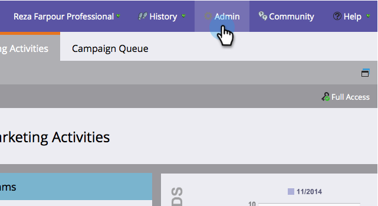

# Adicionar/remover campo de objeto personalizado como restrições de Lista inteligente/acionador {#add-remove-custom-object-field-as-smart-list-trigger-constraints}

O Marketo fornece controle de granulação sobre a sincronização de objetos personalizados do Salesforce. Isso permite selecionar os campos disponíveis como restrições em filtros de objetos personalizados e usá-los como disparadores em campanhas inteligentes.

>[!NOTE]
>
>**Permissões de administrador necessárias**

1. Clique em **Admin.**

   

1. Clique em **Admin** e, em seguida, em Sincronizar objetos do **Salesforce.**

   

1. **A Sincronização** de objetos do Salesforce aparece na coluna esquerda.

   

1. Selecione o objeto que deseja modificar.

   

1. Clique em **Editar campos** visíveis.

   >[!TIP]
   >
   >Se o botão **Editar campos** visíveis estiver acinzentado, o objeto está sendo usado em uma lista inteligente ou campanha inteligente. Remova todas as associações para continuar.

   

1. Se a sincronização global estiver ativada, clique em **Desativar sincronização** global.

   

1. Marque as caixas ao lado das restrições de filtro/acionador necessárias e clique em **Salvar**.

   

   >[!NOTE]
   >
   >Todos os campos são selecionados por padrão para serem restrições em filtros.

1. Clique na guia **Campos** para confirmar suas alterações.

   

   >[!NOTE]
   >
   >**Lembrete**
   >
   >
   >Não se esqueça de reativar sua sincronização global!

Uau! Agora suas listas inteligentes e campanhas inteligentes têm ainda mais poder.

>[!MORELIKETHIS]
>
>* [Ativar/desativar sincronização de objetos personalizados](enable-disable-custom-object-sync.md)

>

